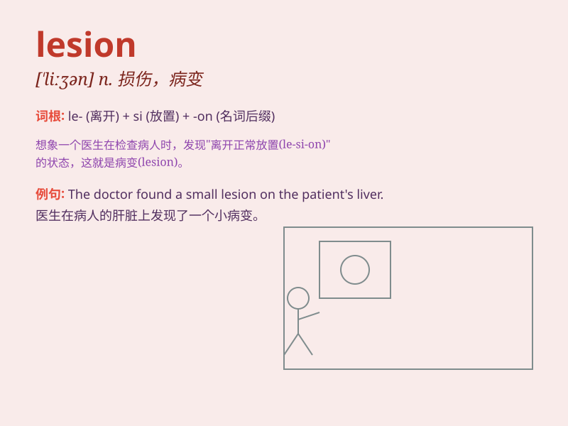

## lesion

**英音:** _[\'liːʒ(ə)n]_ **美音:** _[\'liːʒ(ə)n]_

**译义:** *n.损害,身体上的伤害*

### 短语

+ **cutaneous lesion:** _皮肤损伤_

+ **brain lesion:** _脑部损伤_

+ **lesion site:** _损伤部位_

+ **healing lesion:** _愈合的损伤_

+ **chronic lesion:** _慢性损伤_

### 例句

#### 例句1

> **The doctor found a lesion on her skin during the examination.**

**中文翻译:** 医生在检查时在她的皮肤上发现了一处损伤。

**单词释义:** 损伤；损害；伤口

#### 例句2

> **The lesion in his lung was caused by long-term smoking.**

**中文翻译:** 他肺部的病变是由长期吸烟引起的。

**单词释义:** 病变

#### 例句3

> **The biopsy confirmed that the lesion was benign.**

**中文翻译:** 活检证实这个损伤是良性的。

**单词释义:** 损伤；损害

### 背诵小故事

> A doctor was examining a patient and found a lesion on the skin. It
looked strange and worried the doctor. But after careful tests, it
turned out to be a minor lesion that could be easily treated.

**一位医生在为病人检查时，在皮肤上发现了一处损伤。它看起来很奇怪，让医生很担心。但经过仔细检查，发现这只是一处轻微的损伤，很容易治疗。**

### 图义

