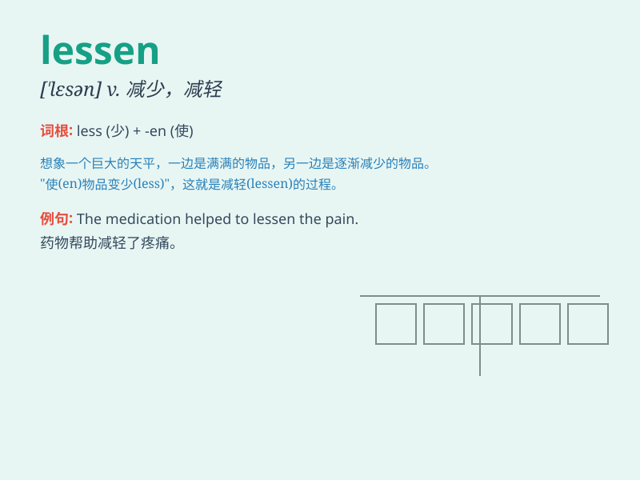

## lessen

**英音:** _[\'les(ə)n]_ **美音:** _[\'lɛsn]_

**译义:** *v.减少,减轻*

### 短语

+ **lessen the impact:** _减轻影响_

+ **lessen the pain:** _减轻疼痛_

+ **lessen the risk:** _降低风险_

+ **lessen the burden:** _减轻负担_

+ **lessen the damage:** _减少损害_

### 例句

#### 例句1

> **Regular exercise can lessen the risk of heart disease.**

**中文翻译:** 经常锻炼可以降低患心脏病的风险。

**单词释义:** 降低

#### 例句2

> **The new policy is expected to lessen the burden on taxpayers.**

**中文翻译:** 新政策有望减轻纳税人的负担。

**单词释义:** 减轻

#### 例句3

> **The pain gradually lessened as the medicine took effect.**

**中文翻译:** 随着药物生效，疼痛逐渐减轻。

**单词释义:** 减轻

### 背诵小故事

> Once upon a time, there was a huge mountain. But as time passed and
the wind blew, the size of the mountain lessened. It became smaller and
smaller. Just like how \'lessen\' means to make something become less or
smaller.

**从前，有一座巨大的山。但随着时间的流逝和风的吹拂，山的大小减小了。它变得越来越小。这就像'lessen'这个词意味着使某物变少或变小。**

### 图义

