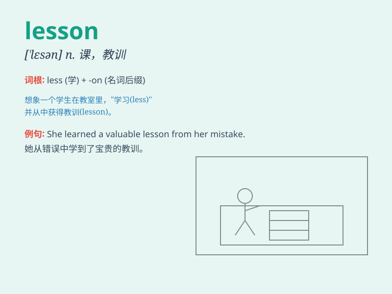

## lesson

**英音:** _[\'les(ə)n]_ **美音:** _[\'lɛsn]_

**译义:** *n.功课,(一节)课,[pl.] 课程,教训*

### 短语

+ **lesson plan:** _教学计划_

+ **private lesson:** _私人课程_

+ **driving lesson:** _驾驶课_

+ **give a lesson:** _授课；教训_

+ **learn a lesson:** _吸取教训_

### 例句

#### 例句1

> **I have a math lesson this morning.**

**中文翻译:** 我今天上午有一节数学课。

**单词释义:** 课；课程

#### 例句2

> **The accident taught us a valuable lesson.**

**中文翻译:** 这次事故给我们上了宝贵的一课。

**单词释义:** 教训

#### 例句3

> **She learned her lesson and never made the same mistake again.**

**中文翻译:** 她吸取了教训，再也没犯同样的错误。

**单词释义:** 教训

### 背诵小故事

> One day, a little bird was lost. An old owl came and taught the bird
a lesson: always remember the way home. The bird learned and never got
lost again. So, \'lesson\' means something learned or taught.

**有一天，一只小鸟迷路了。一只老猫头鹰过来给小鸟上了一课：永远记住回家的路。小鸟学会了，再也没有迷路。所以，\'lesson\'意思是学到的或教授的东西。**

### 图义

