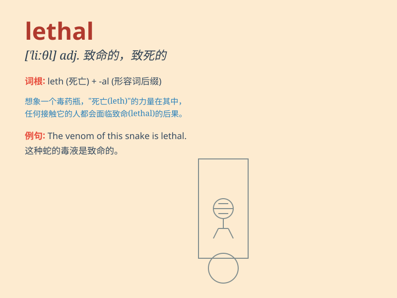

## lethal

**英音:** _[\'liːθ(ə)l]_ **美音:** _[\'liθl]_

**译义:** *adj.致命的n.致死因子*

### 短语

+ **lethal dose:** _致死剂量_

+ **lethal weapon:** _致命武器_

+ **lethal injection:** _致命性注射；注射处死_

+ **lethal force:** _致命武力_

+ **lethal effect:** _致命影响；致命效果_

### 例句

#### 例句1

> **The poison is lethal and can cause immediate death.**

**中文翻译:** 这种毒药是致命的，能导致立即死亡。

**单词释义:** 致命的

#### 例句2

> **A lethal weapon was found in his possession.**

**中文翻译:** 在他身上发现了一件致命武器。

**单词释义:** 致命的

#### 例句3

> **The disease has reached a lethal stage.**

**中文翻译:** 这种疾病已经到了致命的阶段。

**单词释义:** 致命的

### 背诵小故事

> A brave detective was on a case. The criminal used a special poison
which was lethal. But the detective found the antidote just in time.
Lethal means causing or able to cause death.

**一位勇敢的侦探在办案。罪犯使用了一种特殊的毒药，这毒药是致命的。但侦探及时找到了解药。lethal
意思是致命的；可致死的。**

### 图义

