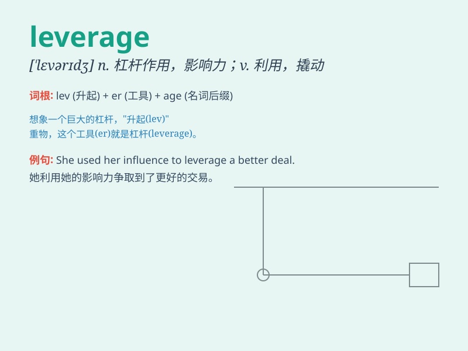

## leverage

**英音:** _[\'liːv(ə)rɪdʒ; \'lev(ə)rɪdʒ]_ **美音:**
_[\'lɛvərɪdʒ]_

**译义:** *n.杠杆作用*

### 短语

+ **financial leverage:** _财务杠杆_

+ **leverage ratio:** _杠杆比率_

+ **leverage effect:** _杠杆效应_

+ **operational leverage:** _经营杠杆_

+ **leverage buyout:** _杠杆收购_

### 例句

#### 例句1

> **The company used financial leverage to expand its business.**

**中文翻译:** 该公司利用财务杠杆来扩大业务。

**单词释义:** 利用；杠杆作用

#### 例句2

> **He tried to leverage his experience to get a better job.**

**中文翻译:** 他试图利用自己的经验找到一份更好的工作。

**单词释义:** 凭借；利用

#### 例句3

> **We need to leverage technology to increase productivity.**

**中文翻译:** 我们需要利用技术来提高生产力。

**单词释义:** 利用

### 背诵小故事

> A small ant wanted to move a big stone. It found a stick and used it
as leverage. With great effort, it finally moved the stone. The stick
gave the ant the power to do what seemed impossible.

**一只小蚂蚁想要移动一块大石头。它找到了一根棍子并把它当作杠杆。经过巨大的努力，它终于移动了石头。这根棍子给了蚂蚁完成看似不可能之事的力量。**

### 图义

