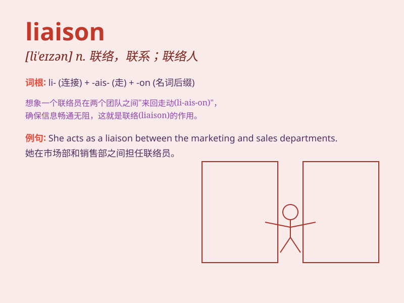

## liaison

**英音:** _[lɪˈeɪzn]_ **美音:** _[ˈlɪəzɒn; lɪəˌzɑn]_

**译义:** *n.联络,(语音)连音*

### 短语

+ **military liaison:** _军事联络_

+ **liaison office:** _联络处_

+ **liaison committee:** _联络委员会_

+ **liaison officer:** _联络官_

+ **maintain liaison:** _保持联络_

### 例句

#### 例句1

> **The liaison between the two departments has improved
communication.**

**中文翻译:** 两个部门之间的联络改善了沟通。

**单词释义:** 联络；联系

#### 例句2

> **She acts as a liaison between the school and the parents.**

**中文翻译:** 她充当学校和家长之间的联络人。

**单词释义:** 联络人；中间人

#### 例句3

> **There was a close liaison during the military operation.**

**中文翻译:** 在军事行动期间有密切的联络。

**单词释义:** 联络；联系

### 背诵小故事

> A chef needed a liaison to communicate between the kitchen and the
dining area. The liaison made sure orders were correct and everyone was
happy. So, liaison means a connection or communication link.

**一位厨师需要一个联络人在厨房和用餐区之间进行沟通。这个联络人确保订单正确，每个人都满意。所以，liaison
意思是联络；联系；联络员**

### 图义

