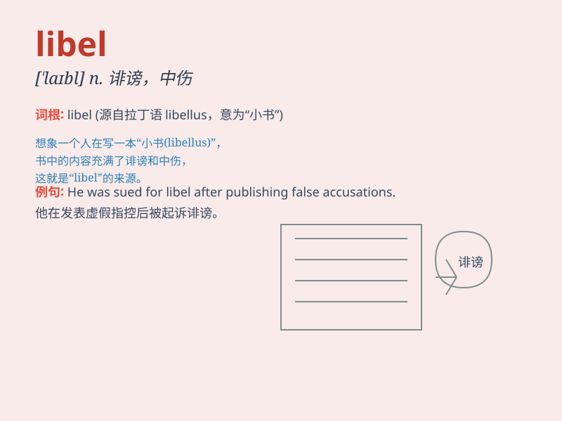

## libel

**英音:** _[\'laɪb(ə)l]_ **美音:** _[\'laɪbl]_

**译义:** *n.以文字损害名誉,诽谤罪,侮辱v.诽谤,中伤,诬蔑,损害名誉*

### 短语

+ **slander and libel:** _诽谤和诋毁_

+ **libel action:** _诽谤诉讼_

+ **libel law:** _诽谤法_

+ **commit libel:** _犯诽谤罪_

+ **libel suit:** _诽谤诉讼_

### 例句

#### 例句1

> **The newspaper was accused of libel for publishing the false
story.**

**中文翻译:** 这家报纸因刊登虚假报道而被指控诽谤。

**单词释义:** 诽谤（行为）

#### 例句2

> **He threatened to sue the magazine for libel.**

**中文翻译:** 他威胁要起诉那家杂志诽谤。

**单词释义:** 诽谤

#### 例句3

> **The politician filed a libel suit against his opponent.**

**中文翻译:** 这位政治家对他的对手提起了诽谤诉讼。

**单词释义:** 诽谤罪

### 背诵小故事

> A journalist wrote an article that was considered a libel against a
famous actor. The actor was very angry and decided to sue the
journalist. Remember, libel means a false and damaging statement in
writing about someone.

**一名记者写了一篇被认为是诽谤一位著名演员的文章。演员非常生气，决定起诉这名记者。记住，libel
意思是书面上关于某人的虚假的、具有损害性的陈述。**

### 图义

