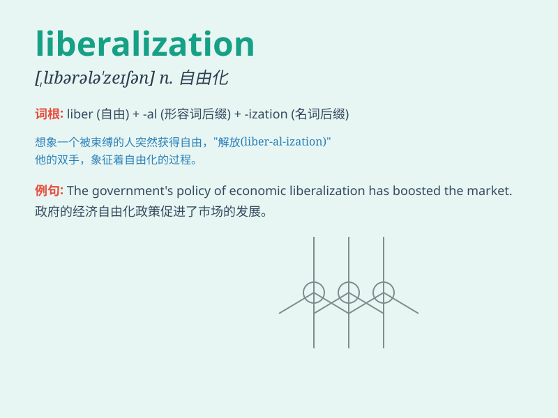

## liberalization

**英音:** _[,lɪbərəlaɪ\'zeɪʃən]_ **美音:**
_[,lɪbərəlaɪ\'zeʃən]_

**译义:** *n.自由主义化,使宽大*

### 短语

+ **trade liberalization:** _贸易自由化_

+ **economic liberalization:** _经济自由化_

+ **financial liberalization:** _金融自由化_

+ **market liberalization:** _市场自由化_

+ **capital liberalization:** _资本自由化_

### 例句

#### 例句1

> **The liberalization of the economy has led to increased foreign
investment.**

**中文翻译:** 经济的自由化导致了外国投资的增加。

**单词释义:** 自由化

#### 例句2

> **The liberalization of trade policies has benefited many
businesses.**

**中文翻译:** 贸易政策的自由化使许多企业受益。

**单词释义:** 自由化

#### 例句3

> **The process of liberalization in the financial sector requires
careful regulation.**

**中文翻译:** 金融部门的自由化进程需要谨慎的监管。

**单词释义:** 自由化

### 背诵小故事

> A small town was trapped in old rules. But one day, a wise leader
came and brought liberalization. People could freely express and do
business. It made the town thrive. Liberalization means the act of
making something less strict or controlled.

**一个小镇被困在旧规则中。但有一天，一位明智的领导者带来了自由化。人们可以自由表达和做生意。这让小镇繁荣起来。liberalization
意思是使某物不那么严格或受控制的行为。**

### 图义

