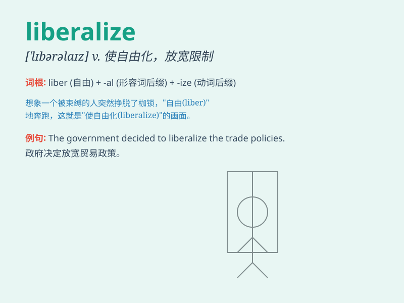

## liberalize

**英音:** _[ˈlɪbrəlaɪz]_ **美音:** _[ˈlɪbrəlaɪz]_

**译义:** *v.自由化*

### 短语

+ **liberalize trade:** _使贸易自由化_

+ **liberalize the economy:** _使经济自由化_

+ **liberalize markets:** _使市场自由化_

+ **liberalize policies:** _使政策自由化_

+ **liberalize regulations:** _使法规自由化_

### 例句

#### 例句1

> **The government is planning to liberalize the economy by reducing
regulations.**

**中文翻译:** 政府正计划通过减少法规来使经济自由化。

**单词释义:** 使自由化

#### 例句2

> **We need to liberalize trade policies to promote international
business.**

**中文翻译:** 我们需要放宽贸易政策以促进国际贸易。

**单词释义:** 放宽；使自由化

#### 例句3

> **The new law aims to liberalize the telecommunications
industry.**

**中文翻译:** 新法律旨在使电信行业自由化。

**单词释义:** 使自由化

### 背诵小故事

> A small country was trapped in an old economic system. Then a wise
leader came and decided to liberalize the market. With this change,
businesses thrived and people\'s lives improved greatly.

**一个小国被困在旧的经济体制中。然后一位明智的领导人来了，决定使市场自由化。随着这一改变，商业繁荣起来，人们的生活大大改善。**

### 图义

