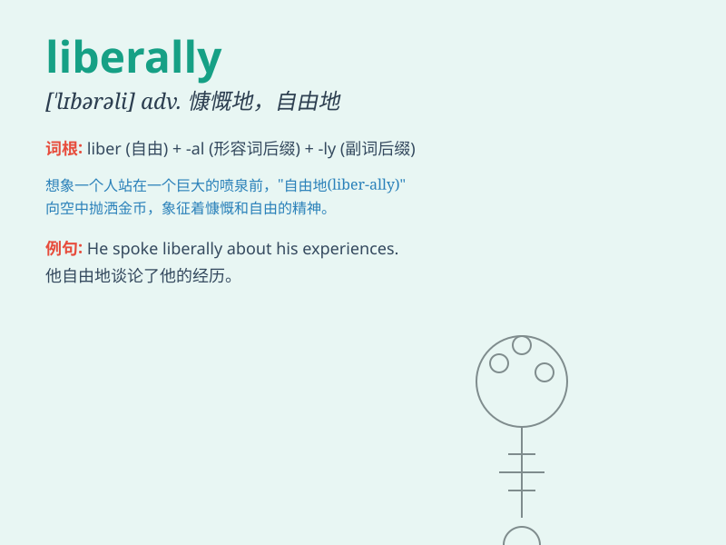

## liberally

**英音:** _[\'lɪbərəli]_ **美音:** _[\'lɪbərəli]_

**译义:** *adv.不受限制地,公平地,大方地*

### 短语

+ **liberally educated:** _受过通识教育的_

+ **liberally interpret:** _自由地解释_

+ **liberally sprinkle:** _大量地撒_

+ **liberally funded:** _资金充裕的_

+ **liberally endowed:** _大量赋予的_

### 例句

#### 例句1

> **The host liberally provided food and drinks for the guests.**

**中文翻译:** 主人慷慨地为客人们提供食物和饮料。

**单词释义:** 慷慨地

#### 例句2

> **She liberally sprinkled perfume on her clothes.**

**中文翻译:** 她随意地在衣服上洒香水。

**单词释义:** 随意地

#### 例句3

> **The artist liberally used bright colors in his paintings.**

**中文翻译:** 这位艺术家在他的画作中大量使用了明亮的色彩。

**单词释义:** 大量地

### 背诵小故事

> A poor student was studying hard. One day, a kind teacher liberally
gave him many useful books, which helped him a lot. The student was very
grateful. \'Liberally\' here means freely and generously.

**一个贫困的学生努力学习。有一天，一位善良的老师慷慨地给了他很多有用的书，这对他帮助很大。学生非常感激。这里'liberally'意思是慷慨地、大方地、自由地。**

### 图义

