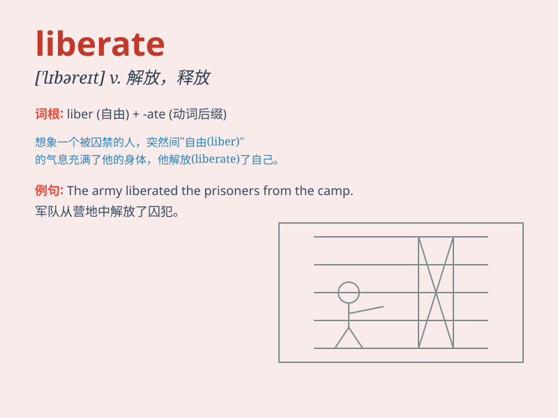

## liberate

**英音:** _[\'lɪbəreɪt]_ **美音:** _[\'lɪbə\'ret]_

**译义:** *v.解放,释放*

### 短语

+ **liberate from:** _从\...解放_

+ **liberate somebody/something:** _解放某人/某物_

+ **liberate the mind:** _解放思想_

+ **liberate a city:** _解放一座城市_

+ **liberate prisoners:** _释放囚犯_

### 例句

#### 例句1

> **The country was liberated after years of war.**

**中文翻译:** 这个国家经过多年战争后获得了解放。

**单词释义:** 解放

#### 例句2

> **They are working hard to liberate themselves from poverty.**

**中文翻译:** 他们正在努力工作以摆脱贫困。

**单词释义:** 使摆脱；使解放

#### 例句3

> **The new law will liberate many small businesses from unnecessary
regulations.**

**中文翻译:** 新法律将使许多小企业摆脱不必要的规章制度。

**单词释义:** 使不受（约束或限制）

### 背诵小故事

> A brave soldier led a mission to liberate the captured villagers.
They fought hard and finally broke the chains, setting the villagers
free. \'Liberate\' means to set free or release from confinement or
oppression.

**一位勇敢的士兵领导了一项任务去解放被俘的村民。他们奋力战斗，最终打破了锁链，让村民获得了自由。\'liberate\'意思是解放，使摆脱束缚或压迫。**

### 图义

