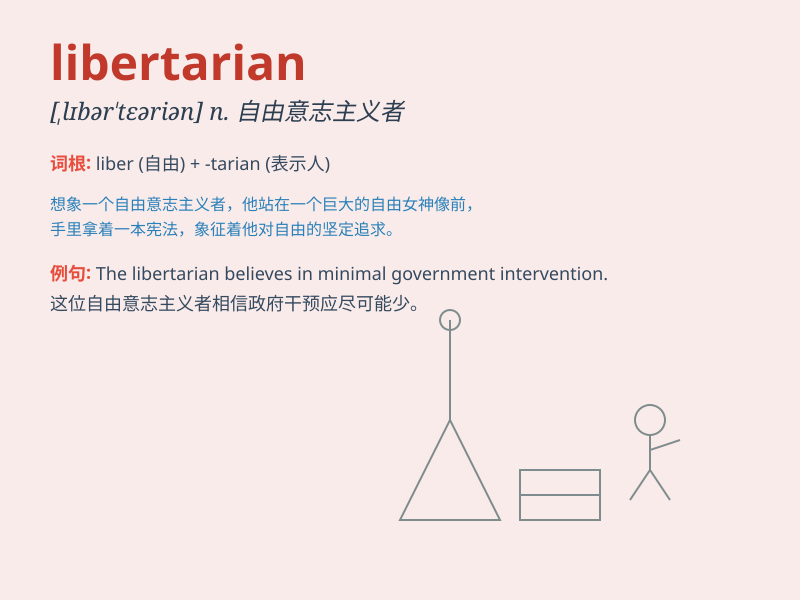

## libertarian

**英音:** _[,lɪbə\'teərɪən]_ **美音:** _[,lɪbɚ\'tɛrɪən]_

**译义:**
*n.自由意志主义者,行动自由论者adj.自由的,持自由论的,自由论者的*

### 短语

+ **libertarian socialism:** _自由意志社会主义_

+ **libertarian party:** _自由党_

+ **libertarian thought:** _自由意志主义思想_

+ **libertarian movement:** _自由意志主义运动_

+ **libertarian philosophy:** _自由意志主义哲学_

### 例句

#### 例句1

> **He is a passionate libertarian who advocates for minimal
government intervention.**

**中文翻译:** 他是一位热情的自由意志主义者，主张政府干预最小化。

**单词释义:** 自由意志主义者

#### 例句2

> **The libertarian view emphasizes individual freedom and
autonomy.**

**中文翻译:** 自由意志主义的观点强调个人自由和自主。

**单词释义:** 自由意志主义的

#### 例句3

> **She subscribes to libertarian principles in economic policy.**

**中文翻译:** 她在经济政策方面认同自由意志主义原则。

**单词释义:** 自由意志主义的

### 背诵小故事

> A libertarian named Lily always fought for freedom. She believed
everyone should have the right to make their own choices without too
much government interference. Her passion for libertarian ideas made her
a voice for individual liberty.

**有一个叫莉莉的自由意志主义者总是为自由而战。她认为每个人都应该有权在没有过多政府干涉的情况下做出自己的选择。她对自由意志主义理念的热情使她成为个人自由的代言人。**

### 图义

