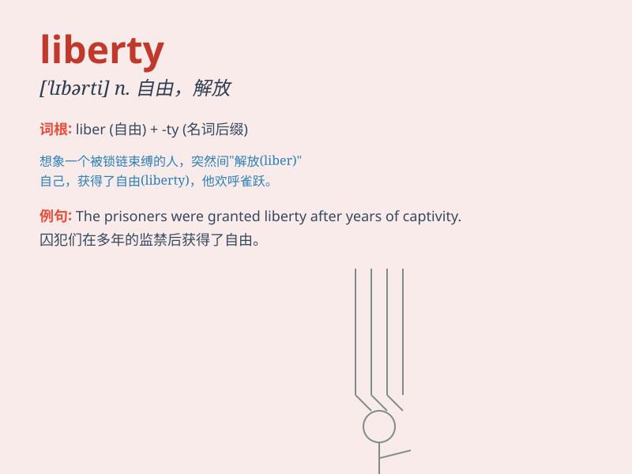

## liberty

**英音:** _[\'lɪbətɪ]_ **美音:** _[\'lɪbɚti]_

**译义:** *n.自由,特权,随意,冒失,冒昧,失礼*

### 短语

+ **at liberty:** _自由；有空；随意_

+ **personal liberty:** _个人自由_

+ **liberty of speech:** _言论自由_

+ **liberty of conscience:** _信仰自由_

+ **take the liberty:** _冒昧；擅自_

### 例句

#### 例句1

> **Everyone should have the liberty to express their opinions
freely.**

**中文翻译:** 每个人都应该有自由表达自己意见的自由。

**单词释义:** 自由

#### 例句2

> **He took the liberty of using my computer without asking.**

**中文翻译:** 他未经询问就擅自使用了我的电脑。

**单词释义:** 擅自；自作主张

#### 例句3

> **The statue symbolizes liberty and justice.**

**中文翻译:** 这座雕像象征着自由和正义。

**单词释义:** 自由

### 背诵小故事

> A bird was trapped in a cage. One day, the door opened and it flew
freely, experiencing liberty. It soared high in the sky, enjoying the
boundless space. Liberty means the freedom to do what one wants.

**一只鸟被困在笼子里。有一天，门开了，它自由地飞了出去，体验到了自由。它在高空翱翔，享受着无边无际的空间。Liberty
意思是自由，做自己想做的事的权利。**

### 图义

