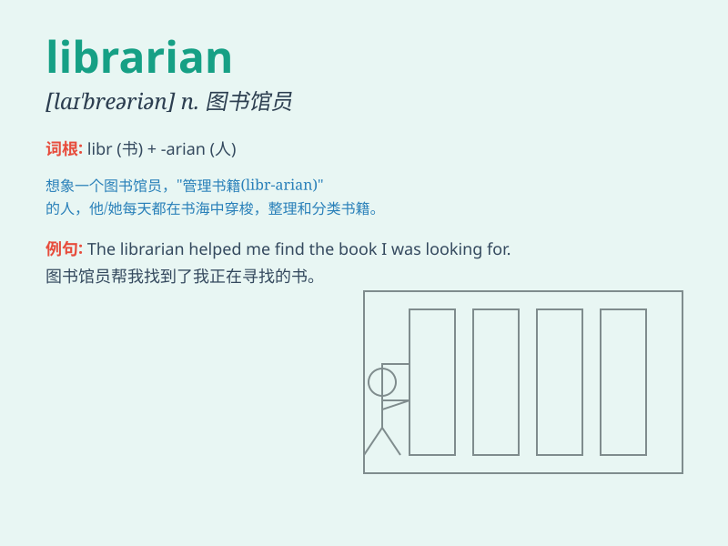

## librarian

**英音:** _[laɪ\'breərɪən]_ **美音:** _[laɪ\'brɛrɪən]_

**译义:** *n.图书馆员,图书管理员*

### 短语

+ **school librarian:** _学校图书管理员_

+ **public librarian:** _公共图书馆管理员_

+ **chief librarian:** _图书馆馆长_

+ **assistant librarian:** _助理图书管理员_

+ **experienced librarian:** _经验丰富的图书管理员_

### 例句

#### 例句1

> **The librarian helped me find the book I was looking for.**

**中文翻译:** 这位图书管理员帮我找到了我正在寻找的书。

**单词释义:** 图书管理员

#### 例句2

> **She decided to become a librarian because of her love for
books.**

**中文翻译:** 因为热爱书籍，她决定成为一名图书管理员。

**单词释义:** 图书管理员

#### 例句3

> **The librarian organized the new arrivals on the shelves.**

**中文翻译:** 图书管理员把新到的书整理到书架上。

**单词释义:** 图书管理员

### 背诵小故事

> A librarian named Lily works in a big library. Every day, she helps
people find the books they need. She loves her job as it connects people
with knowledge. Lily is the best librarian ever!

**一位名叫莉莉的图书管理员在一个大图书馆工作。每天，她帮助人们找到他们需要的书。她热爱自己的工作，因为它将人们与知识联系起来。莉莉是有史以来最好的图书管理员！**

### 图义

