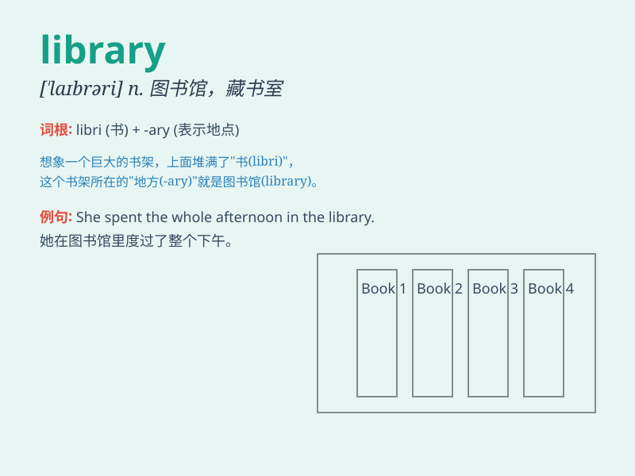

## library

**英音:** _[ˈlaɪbrərɪ]_ **美音:** _[laɪˌbrɛrɪ]_

**译义:** *n.图书馆,藏书室,库*

### 短语

+ **public library:** _公共图书馆_

+ **school library:** _学校图书馆_

+ **library card:** _借书证_

+ **digital library:** _数字图书馆_

+ **library science:** _图书馆学_

### 例句

#### 例句1

> **I often go to the library to borrow books.**

**中文翻译:** 我经常去图书馆借书。

**单词释义:** 图书馆

#### 例句2

> **The library has a large collection of rare books.**

**中文翻译:** 这个图书馆有大量的珍本书籍收藏。

**单词释义:** 图书馆

#### 例句3

> **She works as a librarian in the local library.**

**中文翻译:** 她在当地的图书馆当图书管理员。

**单词释义:** 图书馆

### 背诵小故事

> A little boy named Tom loved reading. One day, he got lost and found
a big building. When he entered, he saw many books. It was a library! He
was so happy and spent the whole day there.

**一个叫汤姆的小男孩喜欢读书。有一天，他迷路了，发现了一座大建筑。当他进去时，看到了很多书。这是一个图书馆！他非常高兴，在那里待了一整天。**

### 图义

