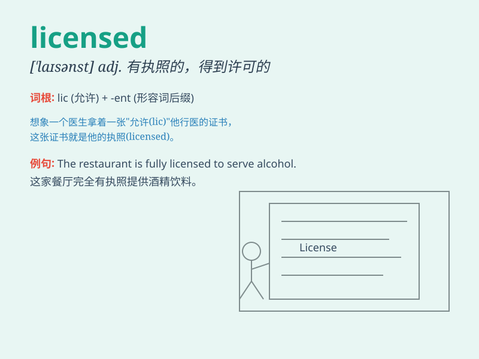

## licensed

**英音:** _[\'laɪs(ə)nst]_ **美音:** _[\'laɪsnst]_

**译义:** *adj.得到许可的*

### 短语

+ **licensed driver:** _有驾照的司机_

+ **licensed product:** _获许可的产品_

+ **licensed professional:** _有执照的专业人员_

+ **licensed establishment:** _有执照的机构_

+ **licensed premises:** _领有执照的经营场所_

### 例句

#### 例句1

> **The restaurant is licensed to sell alcohol.**

**中文翻译:** 该餐厅拥有销售酒类的许可。

**单词释义:** 获得许可

#### 例句2

> **He is a licensed doctor.**

**中文翻译:** 他是一名有执照的医生。

**单词释义:** 有执照的

#### 例句3

> **The software is only available to licensed users.**

**中文翻译:** 该软件仅适用于获得许可的用户。

**单词释义:** 有许可证的

### 背诵小故事

> A young man dreamed of opening a restaurant. After years of hard work
and study, he finally got the licensed certificate. With it, he could
legally start his business and serve delicious food to people.

**一个年轻人梦想开一家餐馆。经过多年的努力工作和学习，他终于获得了许可证。有了它，他可以合法地开始营业，并为人们提供美味的食物。**

### 图义

