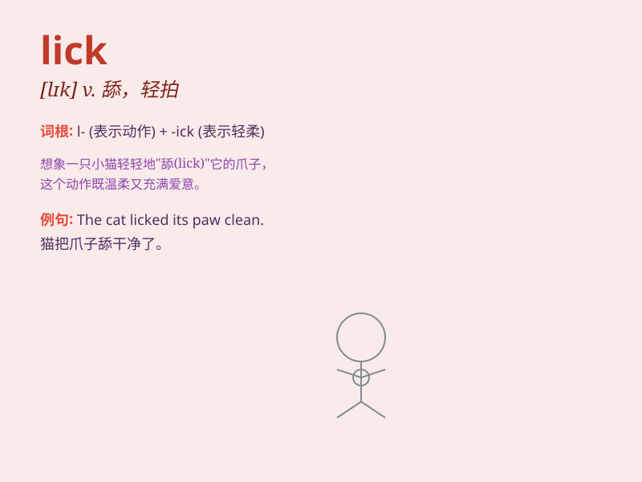

## lick

**英音:** _[lɪk]_ **美音:** _[lɪk]_

**译义:** *n.舔,少许,打vt.舔,卷过,鞭打,克服,征服vi.轻轻拍打*

### 短语

+ **lick up:** _舔光；舐尽_

+ **lick one\'s lips:** _（因期待某事而）舔嘴唇_

+ **give something a lick and a promise:** _草率地做某事_

+ **lick into shape:** _训练；塑造；使成形_

+ **lick the dust:** _被打败；被击倒_

### 例句

#### 例句1

> **The dog licked my hand.**

**中文翻译:** 那只狗舔了我的手。

**单词释义:** 舔

#### 例句2

> **He managed to lick his opponent in the boxing match.**

**中文翻译:** 他在拳击比赛中成功地击败了对手。

**单词释义:** 击败

#### 例句3

> **The flames licked at the building.**

**中文翻译:** 火焰吞噬了建筑物。

**单词释义:** （火）蔓延

### 背诵小故事

> A little puppy was very hungry. It saw a big bone and tried to lick
it to get some taste. But it was too hard. Finally, it found some soft
food and happily licked it up.

**一只小狗非常饿。它看到一根大骨头，试着舔它来尝尝味道。但骨头太硬了。最后，它找到了一些软的食物，开心地舔光了。**

### 图义

