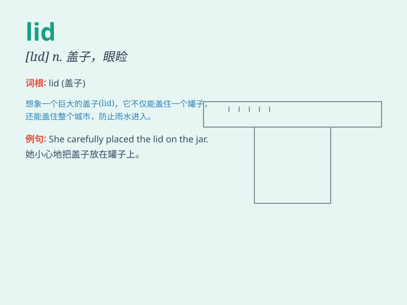

## lid

**英音:** _[lɪd]_ **美音:** _[lɪd]_

**译义:** *n.盖子,\<美口>限制,眼睑vt.给\...盖盖子*

### 短语

+ **put the lid on:** _禁止；取缔；使（某事）结束_

+ **take the lid off:** _揭露；揭开...的盖子_

+ **blow the lid off:** _揭露（丑闻等）_

+ **lift the lid:** _揭露；揭开秘密_

+ **a lid for a box:** _盒子的盖子_

### 例句

#### 例句1

> **She lifted the lid of the pot to check the soup.**

**中文翻译:** 她掀开锅盖检查汤的情况。

**单词释义:** 盖子

#### 例句2

> **The lid of the box was broken.**

**中文翻译:** 盒子的盖子被打破了。

**单词释义:** 盖子

#### 例句3

> **He put the lid on the jar tightly.**

**中文翻译:** 他把罐子盖紧。

**单词释义:** 盖子

### 背诵小故事

> One day, I was cooking and needed to cover the pot. But I couldn\'t
find the lid. I searched everywhere and finally found it under the sink.
The lid protected the food from getting cold.

**有一天，我在做饭，需要盖上锅盖。但我找不到盖子。我到处找，最后在水槽下面找到了。盖子保护食物不会变冷。**

### 图义

