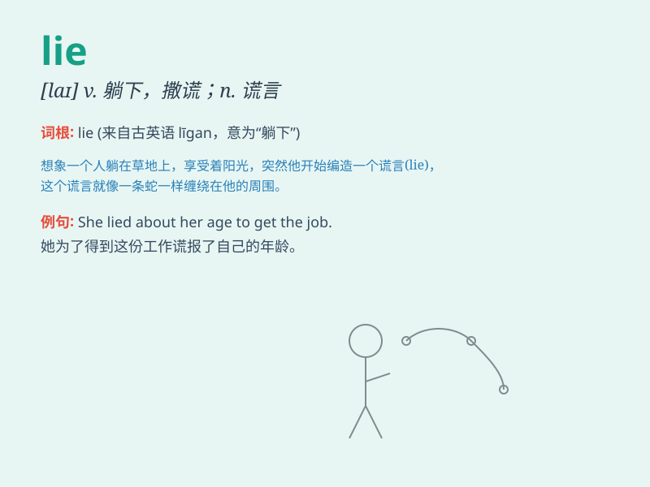

## lie

**英音:** _[laɪ]_ **美音:** _[laɪ]_

**译义:** *vi.躺,平放,展现,展开,位于v.说谎,躺n.谎话,谎言*

### 短语

+ **lie down:** _躺下_

+ **lie in:** _在于；睡懒觉_

+ **tell a lie:** _说谎_

+ **lie ahead:** _在前面；即将发生_

+ **lie behind:** _是......的原因；在......的背后_

### 例句

#### 例句1

> **He told a lie to his parents.**

**中文翻译:** 他对父母撒了谎。

**单词释义:** 谎言；谎话

#### 例句2

> **The village lies at the foot of the mountain.**

**中文翻译:** 村庄位于山脚下。

**单词释义:** 位于；躺；处于

#### 例句3

> **She lies down on the sofa to have a rest.**

**中文翻译:** 她躺在沙发上休息。

**单词释义:** 躺；平卧

### 背诵小故事

> A boy always tells lies. One day, he said he saw a big monster, but
everyone knew it was a lie. Later, he felt bad and decided to always
tell the truth. Remember, lie means to say something untrue.

**一个男孩总是说谎。有一天，他说他看到了一个大怪物，但大家都知道这是个谎言。后来，他感到内疚并决定总是说实话。记住，lie
意思是说不真实的东西。**

### 图义

