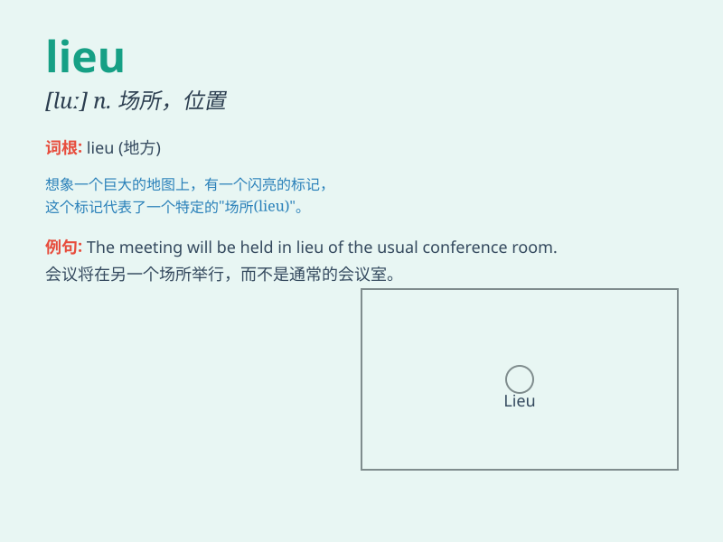

## lieu

**英音:** _[ljuː; luː]_ **美音:** _[lu]_

**译义:** *n.场所*

### 短语

+ **in lieu of:** _代替；取代_

+ **in lieu:** _作为替代_

+ **take the lieu of:** _代替；顶替_

+ **occupy the lieu of:** _占据\...的位置；代替_

+ **fill the lieu of:** _填补\...的位置；代替_

### 例句

#### 例句1

> **In lieu of flowers, the family requests donations to charity.**

**中文翻译:** 家人请求向慈善机构捐款，以代替鲜花。

**单词释义:** 代替

#### 例句2

> **He was given a day off in lieu of payment for overtime
worked.**

**中文翻译:** 他获得了一天的休息日来代替加班费。

**单词释义:** 代替

#### 例句3

> **In lieu of a thank-you note, she sent a box of chocolates.**

**中文翻译:** 她没有寄感谢信，而是寄了一盒巧克力。

**单词释义:** 代替

### 背诵小故事

> A thief was caught and sent to prison. Instead of serving his time,
he tried to find a lieu to escape. But in the end, he was caught again.
\'Lieu\' means a place or position.

**一个小偷被抓进了监狱。他不想服刑，试图找个地方逃跑。但最终又被抓住了。\'lieu\'意思是地方或职位。**

### 图义

