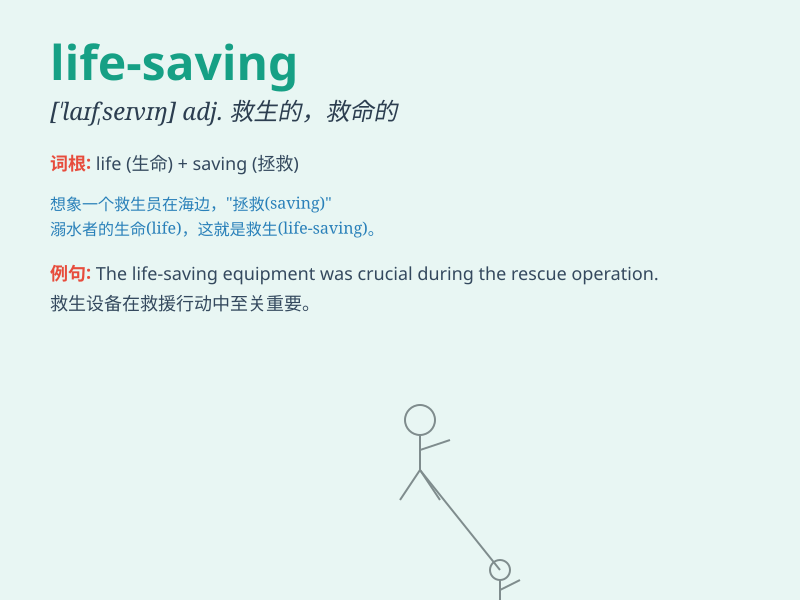

## life-saving

**英音:** _[laɪfˈseɪvɪŋ]_ **美音:** _[laɪfˈseɪvɪŋ]_

**译义:** *adj.救生的；救人的；用于救生的*

### 短语

+ **life-saving device:** _救生设备_

+ **life-saving measure:** _救命措施_

+ **life-saving operation:** _救命手术_

+ **life-saving skill:** _救生技能_

+ **life-saving training:** _救生训练_

### 例句

#### 例句1

> **The life-saving medicine was delivered just in time.**

**中文翻译:** 这种救命的药刚好及时送达。

**单词释义:** 救命的

#### 例句2

> **He performed a life-saving operation on the patient.**

**中文翻译:** 他为病人进行了一次救命的手术。

**单词释义:** 救命的

#### 例句3

> **The life-saving skills she learned came in handy during the
emergency.**

**中文翻译:** 她学到的救命技能在紧急情况下派上了用场。

**单词释义:** 救命的

### 背诵小故事

> A man was drowning in the river. Just when he was about to give up, a
lifeguard came with a life-saving float and pulled him to safety. The
float was truly life-saving.

**一个男人在河里快要溺水了。就在他即将放弃的时候，一名救生员带着一个救生浮标来了，并把他拉到了安全地带。这个浮标真的是救命的。**

### 图义

