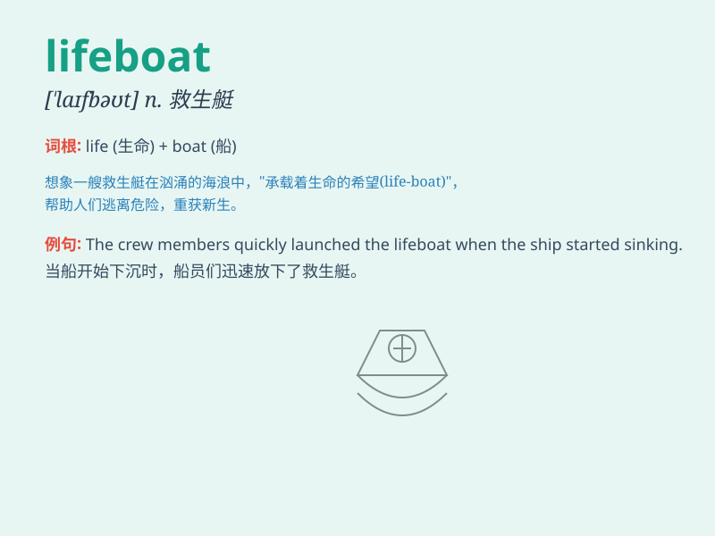

## lifeboat

**英音:** _[\'laɪfbəʊt]_ **美音:** _[\'laɪfbot]_

**译义:** *n.救生艇*

### 短语

+ **lifeboat station:** _救生艇站_

+ **lifeboat drill:** _救生艇演习_

+ **lifeboat crew:** _救生艇船员_

+ **abandon ship to lifeboat:** _弃船登上救生艇_

+ **lifeboat equipment:** _救生艇设备_

### 例句

#### 例句1

> **The lifeboat was launched to rescue the survivors of the
shipwreck.**

**中文翻译:** 救生艇被下水营救海难的幸存者。

**单词释义:** 救生艇

#### 例句2

> **They climbed into the lifeboat just in time before the ship
sank.**

**中文翻译:** 他们在船沉没前及时爬上救生艇。

**单词释义:** 救生艇

#### 例句3

> **The crew prepared the lifeboat for any emergency.**

**中文翻译:** 船员们准备好救生艇以应对任何紧急情况。

**单词释义:** 救生艇

### 背诵小故事

> A group of people was on a sinking ship. They were very scared. But
luckily, there was a lifeboat. Everyone got into it and was saved. The
lifeboat was their hope for survival.

**一群人在一艘正在下沉的船上。他们非常害怕。但幸运的是，有一艘救生艇。每个人都上了救生艇并获救了。救生艇是他们生存的希望。**

### 图义

