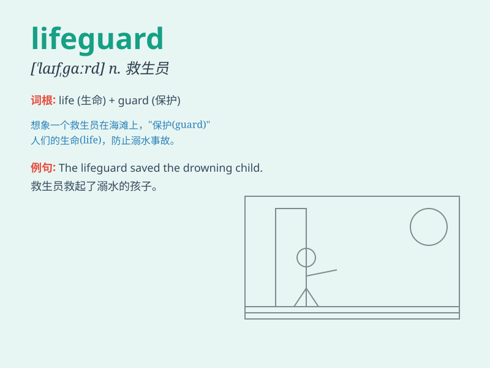

## lifeguard

**英音:** _[\'laɪfgɑːd]_ **美音:** _[\'laɪfɡɑrd]_

**译义:** *n.救生员*

### 短语

+ **lifeguard chair:** _救生员椅_

+ **lifeguard station:** _救生员站_

+ **professional lifeguard:** _专业救生员_

+ **beach lifeguard:** _海滩救生员_

+ **pool lifeguard:** _泳池救生员_

### 例句

#### 例句1

> **The lifeguard was on duty at the beach, keeping a watchful eye on
the swimmers.**

**中文翻译:** 救生员在海滩值班，密切关注游泳者的情况。

**单词释义:** 救生员

#### 例句2

> **She dreams of becoming a lifeguard to save lives in the
ocean.**

**中文翻译:** 她梦想成为一名救生员，在海洋中拯救生命。

**单词释义:** 救生员

#### 例句3

> **The lifeguard blew the whistle to warn the kids not to swim too
far.**

**中文翻译:** 救生员吹响哨子警告孩子们不要游得太远。

**单词释义:** 救生员

### 背诵小故事

> One hot summer day, Tom was swimming at the beach. Suddenly, he
started struggling in the water. Luckily, the lifeguard saw it and swam
quickly to save him. The lifeguard is a hero who protects people\'s
safety in the water.

**在一个炎热的夏日，汤姆在海滩游泳。突然，他在水中挣扎起来。幸运的是，救生员看到了，迅速游过去救了他。救生员是在水中保护人们安全的英雄。**

### 图义

