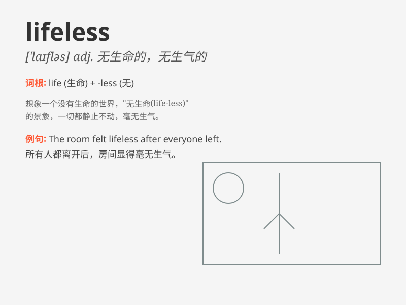

## lifeless

**英音:** _[ˈlaɪfləs]_ **美音:** _[ˈlaɪfləs]_

**译义:** *adj.无生命的,无生气的*

### 短语

+ **lifeless body:** _无生命的躯体_

+ **lifeless eyes:** _无神的眼睛_

+ **lifeless planet:** _无生命的星球_

+ **lifeless landscape:** _毫无生气的风景_

+ **lifeless expression:** _毫无表情_

### 例句

#### 例句1

> **The desert landscape was barren and lifeless.**

**中文翻译:** 沙漠景观贫瘠、毫无生气。

**单词释义:** 无生命的；死气沉沉的

#### 例句2

> **Her eyes had a lifeless expression.**

**中文翻译:** 她的眼神毫无生气。

**单词释义:** 无生气的；呆滞的

#### 例句3

> **The once-vibrant town has become lifeless due to economic
decline.**

**中文翻译:** 曾经充满活力的小镇因经济衰退而变得毫无生气。

**单词释义:** 毫无活力的；死气沉沉的

### 背诵小故事

> A brave explorer entered a cave. Everything inside was still and
silent. The walls were cold, and there was no sign of life. It was a
lifeless place. He felt lonely and scared.

**一位勇敢的探险家进入了一个洞穴。里面的一切都静止且寂静。墙壁冰冷，没有生命的迹象。这是一个毫无生机的地方。他感到孤独和害怕。**

### 图义

