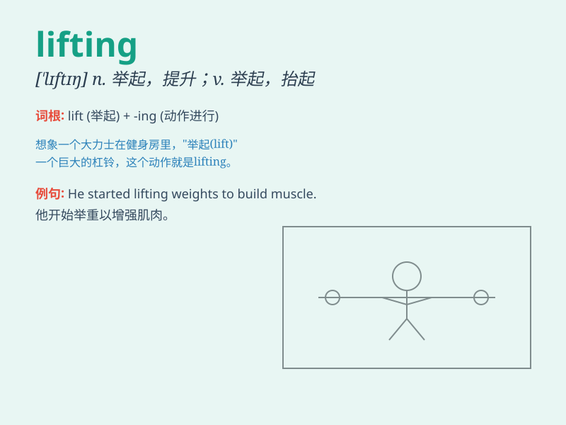

## lifting

**英音:** _[ˈlɪftɪŋ]_ **美音:** _[ˈlɪf.tɪŋ]_

**译义:** *n. 提升，上升；举起的行为或实例

使上升或提高的动作

adj. 提升的，上升的；令人振奋的*

### 短语

+ **lifting equipment:** _起重设备_

+ **lifting force:** _升力；起重力_

+ **lifting platform:** _升降平台_

+ **lifting mechanism:** _提升机构_

+ **lifting operation:** _起重作业_

### 例句

#### 例句1

> **The workers are engaged in heavy lifting at the construction
site.**

**中文翻译:** 工人们正在建筑工地上从事重物搬运工作。

**单词释义:** 搬运，举起

#### 例句2

> **Lifting weights is a good way to build muscle.**

**中文翻译:** 举重是锻炼肌肉的好方法。

**单词释义:** 举起

#### 例句3

> **The lifting of the ban brought great joy to the people.**

**中文翻译:** 禁令的解除给人们带来了极大的欢乐。

**单词释义:** 解除

### 背诵小故事

> A strong man was doing lifting in the gym. He lifted heavy weights
with great effort. His goal was to become stronger and healthier. With
each lift, he got closer to his dream.

**一个强壮的男人正在健身房做举重。他费力地举起很重的杠铃。他的目标是变得更强壮更健康。每一次举起，他都离梦想更近一步。**

### 图义

