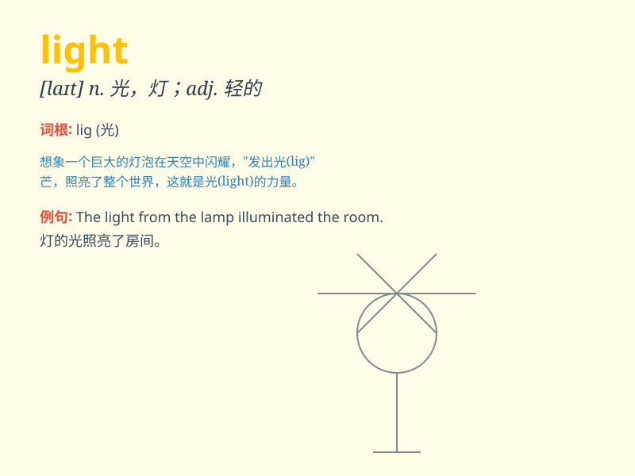

## light

**英音:** _[laɪt]_ **美音:** _[laɪt]_

**译义:**
*n.光,日光,发光体,灯adj.轻的,发光的,明亮的,浅的vt.点燃,照亮adv.轻地vi.点着,变亮*

### 短语

+ **light up:** _照亮；点亮；露出喜色_

+ **in the light of:** _鉴于；由于；按照_

+ **light bulb:** _电灯泡_

+ **light blue:** _浅蓝色_

+ **light years:** _很长时间；光年_

### 例句

#### 例句1

> **The room was filled with soft light.**

**中文翻译:** 房间里充满了柔和的光线。

**单词释义:** 光线

#### 例句2

> **She has light brown hair.**

**中文翻译:** 她有一头浅棕色的头发。

**单词释义:** 浅色的

#### 例句3

> **It\'s a light suitcase. I can carry it easily.**

**中文翻译:** 这是一个轻便的手提箱。我可以轻松携带它。

**单词释义:** 轻的

### 背诵小故事

> A little firefly was lost in the dark. It was very scared. Suddenly,
it saw a light. The light was from a lantern held by a kind girl. The
firefly followed the light and found its way home.

**一只小萤火虫在黑暗中迷路了，它非常害怕。突然，它看到了一束光。这束光是一个善良的女孩拿着的灯笼发出的。萤火虫跟着这束光找到了回家的路。**

### 图义

