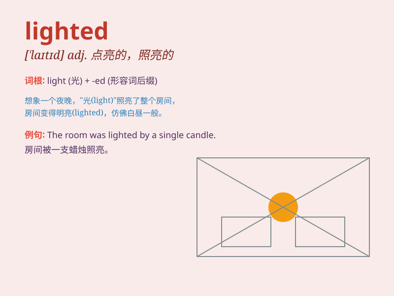

## lighted

**英音:** _[ˈlaɪtɪd]_ **美音:** _[ˈlaɪtɪd]_

**译义:**
*adj.有光的，被照亮的；已点火的（light的过去式和过去分词形式）*

### 短语

+ **lighted candle:** _点燃的蜡烛_

+ **lighted match:** _点燃的火柴_

+ **lighted torch:** _点燃的火炬_

+ **lighted lantern:** _点亮的灯笼_

+ **lighted room:** _亮着灯的房间_

### 例句

#### 例句1

> **The room was lighted by a single candle.**

**中文翻译:** 房间被一支蜡烛照亮。

**单词释义:** 被点亮；被照亮

#### 例句2

> **He lighted a cigarette and sat down.**

**中文翻译:** 他点燃了一支香烟然后坐下。

**单词释义:** 点燃

#### 例句3

> **The stage was beautifully lighted for the performance.**

**中文翻译:** 舞台为这场表演被布置得灯光美轮美奂。

**单词释义:** 照亮；布置灯光

### 背诵小故事

> One dark night, I was lost in the forest. Suddenly, a lighted lantern
appeared, guiding me out. The lighted lantern was like a savior in the
darkness. It made me remember \'lighted\' means filled with light.

**在一个漆黑的夜晚，我在森林里迷路了。突然，出现了一盏点亮的灯笼，引领我走出去。这盏点亮的灯笼在黑暗中就像救星。这让我记住了\'lighted\'意思是充满光的、被点亮的。**

### 图义

