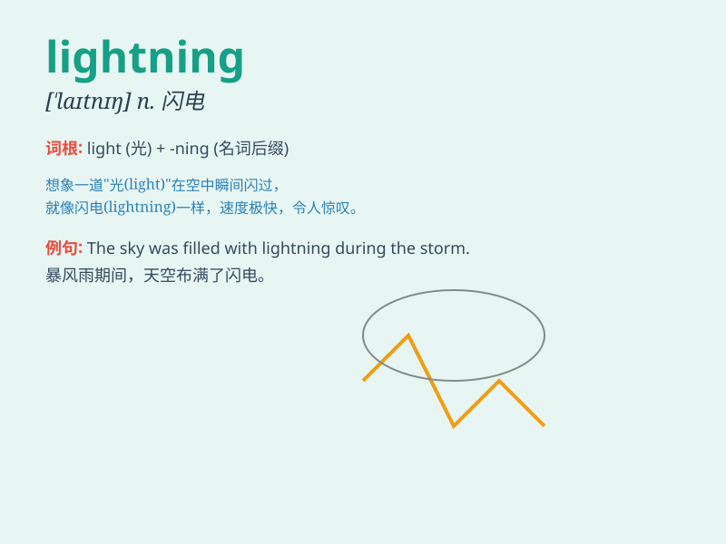

## lightning

**英音:** _[\'laɪtnɪŋ]_ **美音:** _[\'laɪtnɪŋ]_

**译义:** *n.闪电 (\"闪电\")
英国第一种超音速喷气式战斗机,英60年代的主力机种。*

### 短语

+ **lightning strike:** _雷击；闪电袭击_

+ **lightning rod:** _避雷针；引火烧身的人_

+ **lightning fast:** _极快的；闪电般的速度_

+ **lightning bug:** _萤火虫_

+ **lightning storm:** _雷暴_

### 例句

#### 例句1

> **The lightning flashed across the sky.**

**中文翻译:** 闪电划过天空。

**单词释义:** 闪电

#### 例句2

> **He moved as fast as lightning.**

**中文翻译:** 他的动作快如闪电。

**单词释义:** 闪电（喻指极快的速度）

#### 例句3

> **The tree was struck by lightning.**

**中文翻译:** 那棵树被闪电击中了。

**单词释义:** 闪电

### 背诵小故事

> One night, I was walking in the park. Suddenly, the sky turned dark
and lightning flashed across the sky. It was so bright that it
illuminated everything around me. I ran home quickly.

**一天晚上，我正在公园里散步。突然，天空变暗，闪电划过天空。它如此明亮，照亮了我周围的一切。我赶紧跑回家。**

### 图义

