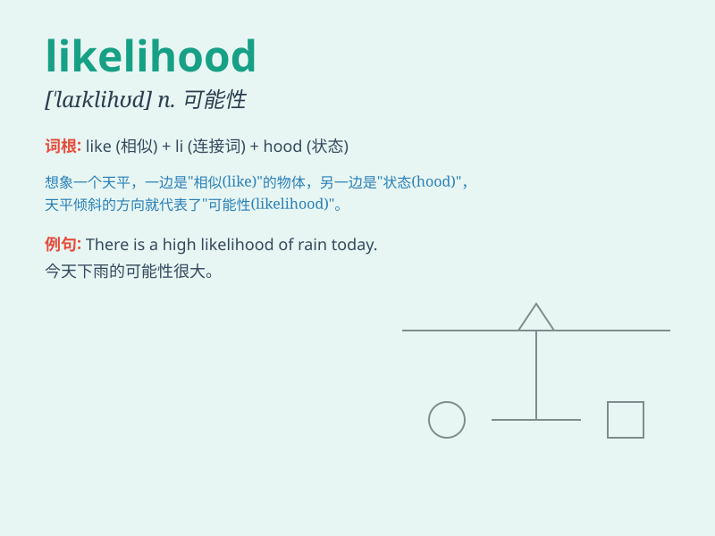

## likelihood

**英音:** _[\'laɪklɪhʊd]_ **美音:** _[\'laɪklɪhʊd]_

**译义:** *n.可能,可能性*

### 短语

+ **in all likelihood:** _很可能，十有八九_

+ **the likelihood of:** _\...\...的可能性_

+ **likelihood ratio:** _似然比_

+ **maximum likelihood:** _最大似然_

+ **likelihood function:** _似然函数_

### 例句

#### 例句1

> **There is a high likelihood of rain tomorrow.**

**中文翻译:** 明天下雨的可能性很大。

**单词释义:** 可能性；可能

#### 例句2

> **The likelihood of success depends on your efforts.**

**中文翻译:** 成功的可能性取决于你的努力。

**单词释义:** 可能性；可能

#### 例句3

> **In all likelihood, he will arrive late.**

**中文翻译:** 他很可能会迟到。

**单词释义:** 可能性；可能

### 背诵小故事

> A detective was trying to solve a mystery. The likelihood of finding
the culprit was low. But with careful clues and smart thinking, the
chances improved. Finally, the truth was revealed. \'Likelihood\' means
the probability or chance of something happening.

**一位侦探试图解开一个谜团。找到罪犯的可能性很低。但通过仔细的线索和聪明的思考，机会增加了。最后，真相被揭示了。\'likelihood\'意思是某事发生的概率或可能性。**

### 图义

