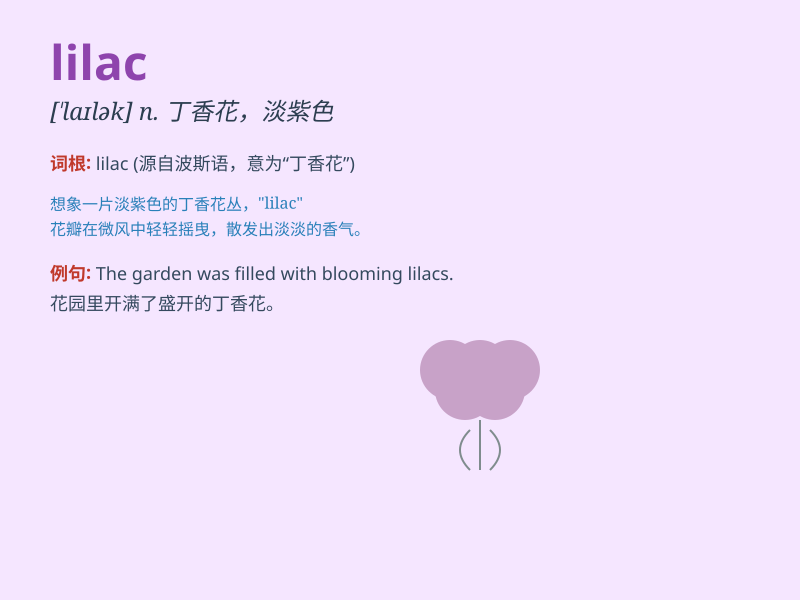

## lilac

**英音:** _[\'laɪlək]_ **美音:** _[\'laɪlək]_

**译义:**
*n.[植]丁香(尤指西洋丁花)紫丁香,丁香花,淡紫色adj.淡紫色的*

### 短语

+ **lilac bush:** _丁香灌木丛_

+ **lilac flower:** _丁香花_

+ **lilac scent:** _丁香花香_

+ **lilac color:** _淡紫色_

+ **lilac tree:** _丁香树_

### 例句

#### 例句1

> **The garden was filled with fragrant lilacs.**

**中文翻译:** 花园里长满了芬芳的紫丁香。

**单词释义:** 丁香花（植物名称）

#### 例句2

> **She wore a lilac dress to the party.**

**中文翻译:** 她穿着一件淡紫色的连衣裙去参加聚会。

**单词释义:** 淡紫色（颜色）

#### 例句3

> **The lilac scent always reminds me of my childhood.**

**中文翻译:** 紫丁香的香味总是让我想起我的童年。

**单词释义:** 丁香花（植物名称）

### 背诵小故事

> Once upon a time, in a beautiful garden, there was a little girl. She
loved the color of the flowers, especially the lilac ones. The lilac
flowers were so charming and their smell was sweet. Every time she saw
them, she felt happy.

**从前，在一个美丽的花园里，有一个小女孩。她喜欢花的颜色，尤其是淡紫色的。丁香花是如此迷人，它们的气味很甜。每次她看到它们，她都感到很开心。**

### 图义

