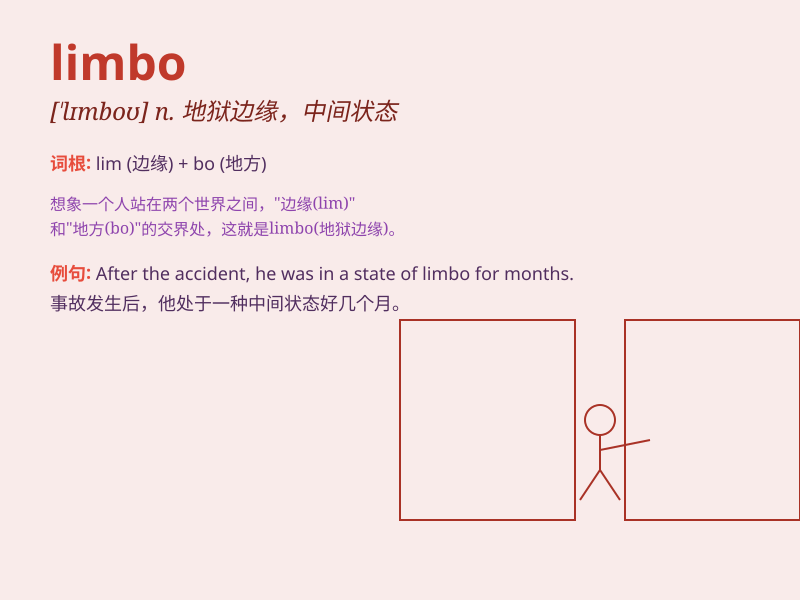

## limbo

**英音:** _[\'lɪmbəʊ]_ **美音:** _[\'lɪmbo]_

**译义:** *n.地狱的边境,监狱*

### 短语

+ **in limbo:** _处于不确定的状态；悬而未决_

+ **leave someone in limbo:** _使某人处于不确定的状态_

+ **be stuck in limbo:** _被困在不确定的境地_

+ **limbo dance:** _林波舞（身体向前俯，从跨下向后看并移动）_

+ **limbo state:** _不确定状态；中间状态_

### 例句

#### 例句1

> **After graduating, she was in limbo, not sure whether to pursue
further studies or look for a job.**

**中文翻译:** 毕业后，她陷入了迷茫，不知道是继续深造还是找工作。

**单词释义:** 不确定的状态；中间过渡状态

#### 例句2

> **The project has been in limbo for months due to lack of
funds.**

**中文翻译:** 由于缺乏资金，该项目已陷入困境数月。

**单词释义:** 被搁置；处于停滞状态

#### 例句3

> **His soul seemed to be trapped in limbo after his death.**

**中文翻译:** 死后，他的灵魂似乎陷入了地狱。

**单词释义:** 地狱的边缘；灵薄狱

### 背诵小故事

> A person was lost in a strange place called Limbo. It was neither
here nor there, just a state of uncertainty. He felt confused and
didn\'t know which way to go. Finally, he found his way out by staying
calm and using his wits.

**一个人在一个叫做'limbo（中间过渡状态；不确定的状态）'的奇怪地方迷路了。这里不在这里也不在那里，只是一种不确定的状态。他感到困惑，不知道该走哪条路。最后，他通过保持冷静和运用智慧找到了出路。**

### 图义

