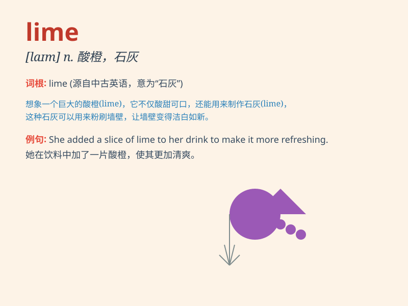

## lime

**英音:** _[laɪm]_ **美音:** _[laɪm]_

**译义:** *n.酸橙,石灰,黏鸟胶*

### 短语

+ **lime juice:** _酸橙汁_

+ **lime green:** _淡绿色_

+ **lime kiln:** _石灰窑_

+ **lime tree:** _欧椴树_

+ **burnt lime:** _生石灰_

### 例句

#### 例句1

> **The bartender added a slice of lime to the cocktail.**

**中文翻译:** 调酒师在鸡尾酒中加了一片酸橙。

**单词释义:** 酸橙

#### 例句2

> **The walls were painted in a bright lime green.**

**中文翻译:** 墙壁被漆成了明亮的柠檬绿。

**单词释义:** 石灰绿（颜色）

#### 例句3

> **She used lime to improve the soil in her garden.**

**中文翻译:** 她用石灰来改善花园里的土壤。

**单词释义:** 石灰

### 背诵小故事

> One day, I was walking in the park and saw a tree full of limes. I
picked one and tasted it. The sour and refreshing flavor made me
remember the word \'lime\' clearly. It\'s a green, citrus fruit.

**有一天，我在公园散步，看到一棵长满酸橙的树。我摘了一个尝了尝。那酸酸的、清爽的味道让我清楚地记住了'lime'这个词。它是一种绿色的柑橘类水果。**

### 图义

