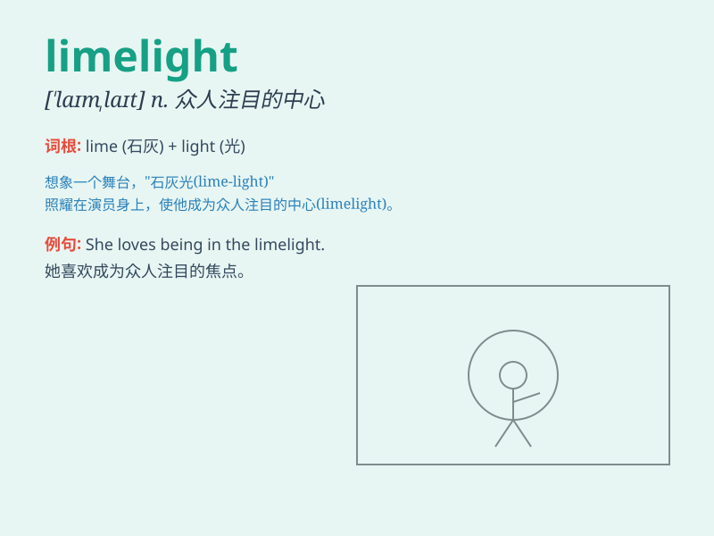

## limelight

**英音:** _[\'laɪmlaɪt]_ **美音:** _[\'laɪmlaɪt]_

**译义:** *n.引人注目的中心*

### 短语

+ **in the limelight:** _引人注目；处于公众关注的中心_

+ **steal the limelight:** _抢风头；出尽风头_

+ **throw someone into the limelight:**
_使某人成为公众关注的焦点_

+ **come out of the limelight:** _不再引人注目；淡出公众视线_

+ **share the limelight:** _共同受到关注；分享公众关注_

### 例句

#### 例句1

> **She has been in the limelight since her new book was
published.**

**中文翻译:** 自从她的新书出版以来，她一直受到人们的关注。

**单词释义:** 公众注意的中心，焦点

#### 例句2

> **He enjoys being in the limelight and having all eyes on him.**

**中文翻译:** 他喜欢成为众人瞩目的焦点，享受所有人的目光。

**单词释义:** 公众瞩目的地位

#### 例句3

> **The politician tried to avoid the limelight after the
scandal.**

**中文翻译:** 丑闻发生后，这位政客试图避免成为众人瞩目的焦点。

**单词释义:** 公众的关注

### 背诵小故事

> A young actor was always dreaming of being in the limelight. One day,
he got a great role and the spotlight was on him. The lime-colored light
made him shine and become famous.

**一位年轻的演员一直梦想着成为众人瞩目的焦点。有一天，他得到了一个很棒的角色，聚光灯打在他身上。青柠色的灯光让他大放异彩并成名。**

### 图义

