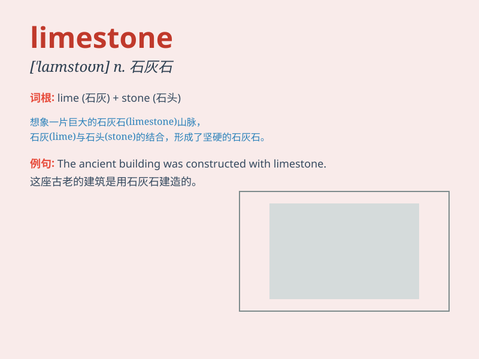

## limestone

**英音:** _[\'laɪmstəʊn]_ **美音:** _[\'laɪmston]_

**译义:** *n.石灰石*

### 短语

+ **limestone cave:** _石灰岩洞穴_

+ **limestone formation:** _石灰岩地层_

+ **limestone quarry:** _石灰岩采石场_

+ **limestone cliff:** _石灰岩悬崖_

+ **limestone deposit:** _石灰岩矿床_

### 例句

#### 例句1

> **The local buildings are made of limestone.**

**中文翻译:** 当地的建筑物是由石灰石建造的。

**单词释义:** 石灰石

#### 例句2

> **The cave is surrounded by limestone cliffs.**

**中文翻译:** 该洞穴周围环绕着石灰岩悬崖。

**单词释义:** 石灰岩

#### 例句3

> **Limestone is often used in construction.**

**中文翻译:** 石灰石经常用于建筑。

**单词释义:** 石灰石

### 背诵小故事

> A brave explorer was lost in a cave. He found a strange rock and
later learned it was limestone. With its unique texture and color, he
never forgot this special stone. Limestone became his key to finding the
way out.

**一位勇敢的探险家在洞穴中迷路了。他发现了一块奇怪的石头，后来得知这是石灰岩。凭借其独特的质地和颜色，他永远不会忘记这块特别的石头。石灰岩成为了他找到出路的关键。**

### 图义

