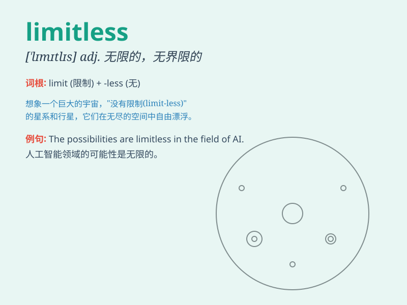

## limitless

**英音:** _[\'lɪmɪtləs]_ **美音:** _[\'lɪmɪtləs]_

**译义:** *adj.无限的,无界限的*

### 短语

+ **limitless power:** _无限的权力_

+ **limitless potential:** _无限的潜力_

+ **limitless imagination:** _无限的想象力_

+ **limitless possibilities:** _无限的可能性_

+ **limitless resources:** _无限的资源_

### 例句

#### 例句1

> **The possibilities of space exploration seem limitless.**

**中文翻译:** 太空探索的可能性似乎是无限的。

**单词释义:** 无限的

#### 例句2

> **His imagination is limitless, creating wonderful stories.**

**中文翻译:** 他的想象力是无限的，创造出精彩的故事。

**单词释义:** 无限的

#### 例句3

> **The power of love is often described as limitless.**

**中文翻译:** 爱的力量常常被描述为无限。

**单词释义:** 无限的

### 背诵小故事

> Once upon a time, a little bird dreamed of flying in a limitless sky.
It kept flapping its wings, knowing no boundaries. Finally, it reached
places beyond imagination. Just like the bird, our potential is
limitless.

**从前，一只小鸟梦想在无边无际的天空中飞翔。它不停地扇动翅膀，不知边界。最终，它到达了超乎想象的地方。就像这只鸟一样，我们的潜力是无限的。**

### 图义

