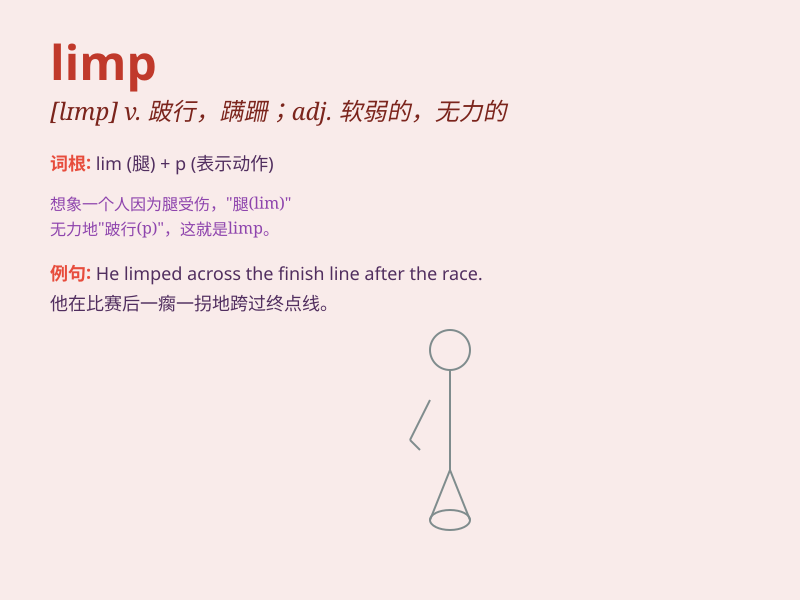

## limp

**英音:** _[lɪmp]_ **美音:** _[lɪmp]_

**译义:** *adj.柔软的,易曲的vi.跛行*

### 短语

+ **limp along:** _缓慢地行进；艰难地维持_

+ **limp handshake:** _无力的握手_

+ **limp home:** _一瘸一拐地回家_

+ **limp wrist:** _软弱无力的手腕_

+ **limp through:** _勉强通过_

### 例句

#### 例句1

> **He was limping after the football game due to an injury.**

**中文翻译:** 足球比赛结束后，他因受伤而一瘸一拐。

**单词释义:** 一瘸一拐地走

#### 例句2

> **The flower\'s stem was limp and drooping.**

**中文翻译:** 花的茎软弱地下垂。

**单词释义:** 软弱无力的；下垂的

#### 例句3

> **The car was limping along the road with engine trouble.**

**中文翻译:** 由于发动机故障，汽车在路上一瘸一拐地行驶。

**单词释义:** 缓慢地行进

### 背诵小故事

>
想象一只受伤的小兔子，一瘸一拐地走着。它的腿受伤了，走起路来软弱无力，摇摇晃晃。这种无力、蹒跚的样子就是\'limp\'。就像人受伤后走路不稳的样子。

**想象一只受伤的小兔子走路不稳的情景来辅助记忆\'limp\'这个单词，意思是蹒跚，跛行，无力地移动**

### 图义

