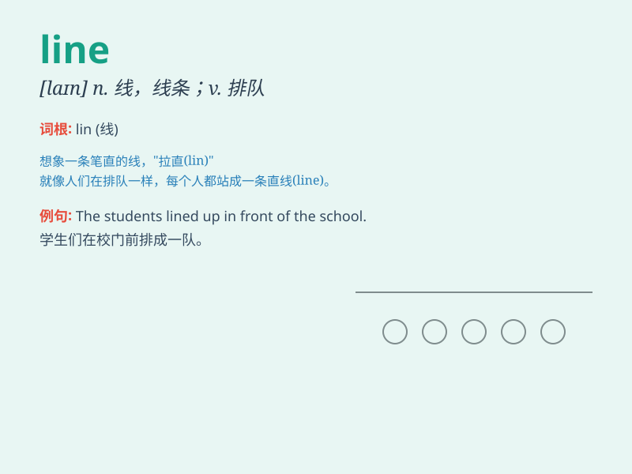

## line

**英音:** _[laɪn]_ **美音:** _[laɪn]_

**译义:**
*n.绳,索,线路,航线,诗句vt.排成一行,顺\...排列,划线于,使有线条,使起皱纹vi.排队*

### 短语

+ **in line:** _成一直线；整齐；一致_

+ **line up:** _排成一行；排队；整队_

+ **on the line:** _处于危险中；模棱两可；在电话线上_

+ **bottom line:** _底线；最重要的因素；最终结果_

+ **straight line:** _直线_

### 例句

#### 例句1

> **The clothes line was full of wet laundry.**

**中文翻译:** 晾衣绳上堆满了湿衣服。

**单词释义:** 绳子；线；排；行

#### 例句2

> **Please stand in line.**

**中文翻译:** 请排队。

**单词释义:** 排；行；队列

#### 例句3

> **She traced a line on the paper.**

**中文翻译:** 她在纸上画了一条线。

**单词释义:** 线；线条

### 背诵小故事

> One day, Tom was waiting in a long line at the cinema. He was very
impatient. But finally, he got his ticket. The line made him understand
that sometimes we need to wait patiently for good things.

**一天，汤姆在电影院排着长队等待。他非常不耐烦。但最后，他拿到了票。这条队伍让他明白，有时我们需要耐心等待好事。**

### 图义

