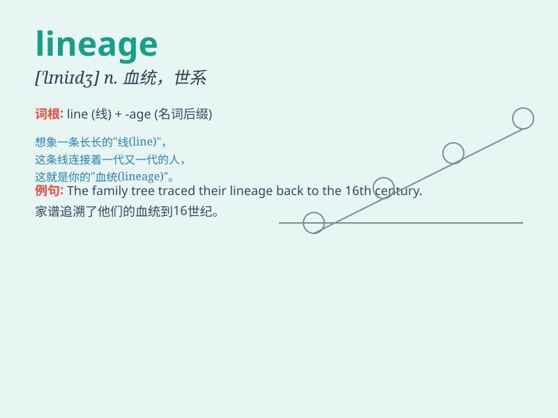

## lineage

**英音:** _[\'lɪnɪɪdʒ]_ **美音:** _[\'lɪnɪɪdʒ]_

**译义:** *n.血统,世系*

### 短语

+ **family lineage:** _家族世系_

+ **direct lineage:** _直系世系_

+ **noble lineage:** _贵族血统_

+ **lineage group:** _世系群_

+ **ancient lineage:** _古老的世系_

### 例句

#### 例句1

> **She was proud of her noble lineage.**

**中文翻译:** 她为自己的高贵血统感到自豪。

**单词释义:** 血统；世系

#### 例句2

> **The family\'s lineage can be traced back several centuries.**

**中文翻译:** 这个家族的血统可以追溯到几个世纪前。

**单词释义:** 世系；家族血统

#### 例句3

> **The study of plant lineage helps us understand evolution.**

**中文翻译:** 对植物谱系的研究有助于我们了解进化论。

**单词释义:** 世系；宗系

### 背诵小故事

> A long time ago, in a kingdom, the king carefully recorded the line
of descendants. This line, showing the sequence from ancestors to the
present, was called \'lineage\'. It told the story of each generation\'s
connection and heritage.

**很久以前，在一个王国里，国王仔细记录了后裔的脉络。这条展示了从祖先到当下的序列被称为'lineage'。它讲述了每一代之间的联系和传承。**

### 图义

