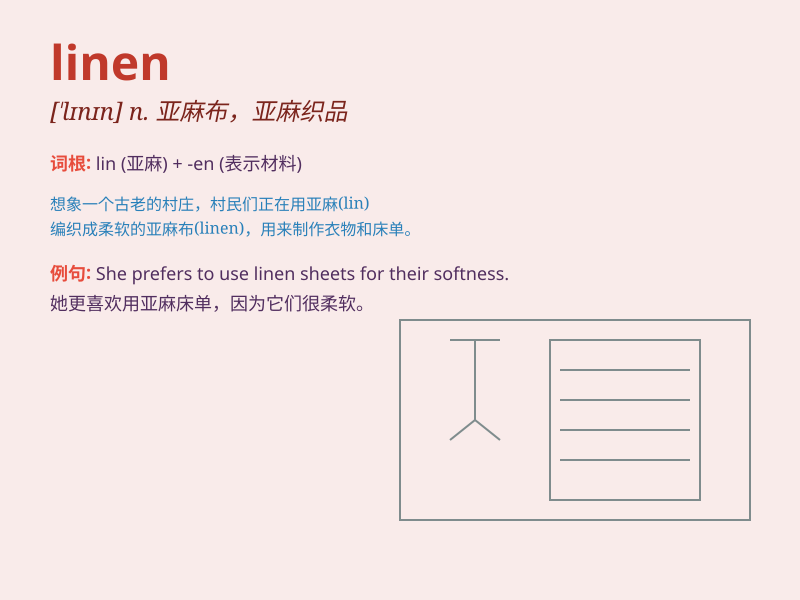

## linen

**英音:** _[\'lɪnɪn]_ **美音:** _[\'lɪnɪn]_

**译义:**
*n.亚麻布,亚麻制品,亚麻纤维制成的优质纸adj.亚麻布制的,亚麻的*

### 短语

+ **linen cloth:** _亚麻布_

+ **linen closet:** _亚麻织品壁橱_

+ **linen suit:** _亚麻套装_

+ **linen tablecloth:** _亚麻桌布_

+ **linen sheet:** _亚麻床单_

### 例句

#### 例句1

> **She wore a beautiful linen dress to the party.**

**中文翻译:** 她穿着一件漂亮的亚麻连衣裙去参加聚会。

**单词释义:** 亚麻布；亚麻制品

#### 例句2

> **The hotel provides linen and towels for guests.**

**中文翻译:** 酒店为客人提供床单和毛巾。

**单词释义:** 亚麻布制品

#### 例句3

> **The linen closet is full of clean sheets.**

**中文翻译:** 亚麻衣柜里装满了干净的床单。

**单词释义:** 亚麻布

### 背诵小故事

> One hot summer day, I was sweating a lot. Then I found a soft and
cool linen shirt in my closet. Wearing it, I felt so comfortable and
fresh. Linen really saved my day!

**一个炎热的夏日，我汗流浃背。然后我在衣柜里发现了一件柔软凉爽的亚麻衬衫。穿上它，我感觉非常舒适和清爽。亚麻布真的拯救了我的这一天！**

### 图义

