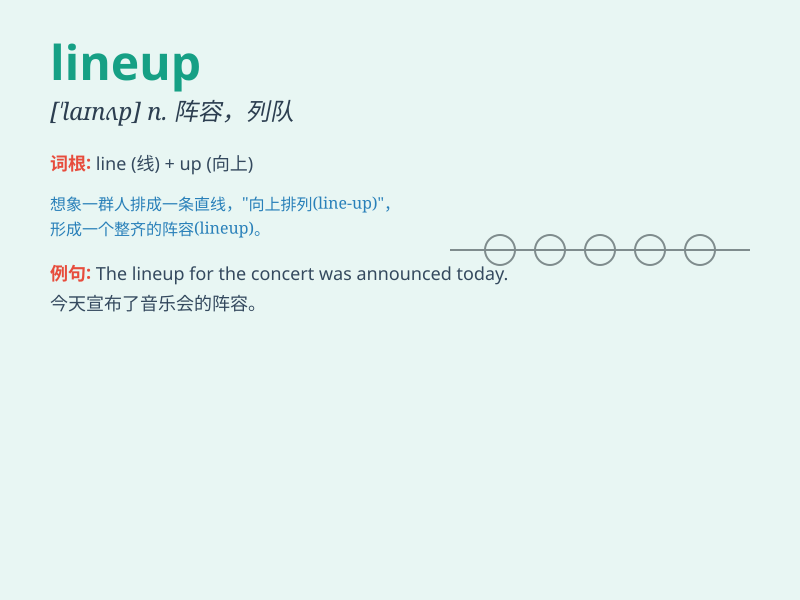

## lineup

**英音:** _[\'laɪnʌp]_ **美音:** _[\'laɪn,ʌp]_

**译义:** *n.阵容,阵形,一组人*

### 短语

+ **lineup for:** _排队等候_

+ **lineup of players:** _球员阵容_

+ **lineup changes:** _阵容变化_

+ **star-studded lineup:** _明星云集的阵容_

+ **strong lineup:** _强大的阵容_

### 例句

#### 例句1

> **The lineup for the concert includes some of the biggest names in
music.**

**中文翻译:** 音乐会的阵容包括一些音乐界的大腕。

**单词释义:** 阵容；一组人

#### 例句2

> **The police are questioning the lineup of suspects.**

**中文翻译:** 警方正在审问嫌疑人。

**单词释义:** 队列；一排

#### 例句3

> **The new product lineup from the company is very impressive.**

**中文翻译:** 该公司的新产品阵容非常令人印象深刻。

**单词释义:** 系列；一组产品

### 背诵小故事

> Imagine a long queue of people waiting in a line. The police are
checking each one. This orderly arrangement of people is called a
lineup. It\'s like a special line where everyone is in position.

**想象一长排人在排队等候。警察正在检查每一个人。这种人员的有序排列就叫做
lineup 。它就像一条特殊的线，每个人都在其位置上。**

### 图义

