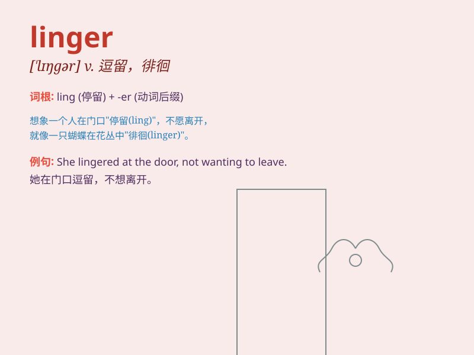

## linger

**英音:** _[\'lɪŋgə]_ **美音:** _[\'lɪŋɡɚ]_

**译义:** *v.逗留,闲荡,拖延,游移*

### 短语

+ **linger on:** _继续存留；缓慢消失_

+ **linger over:** _在\...上拖延；在\...上徘徊_

+ **linger about:** _在附近逗留；在周围徘徊_

+ **linger behind:** _落在后面；逗留不走_

+ **linger in the memory:** _留在记忆中_

### 例句

#### 例句1

> **She lingered at the party, enjoying the company of friends.**

**中文翻译:** 她在聚会上流连忘返，享受着朋友们的陪伴。

**单词释义:** 逗留；徘徊

#### 例句2

> **The smell of her perfume lingered in the room long after she had
left.**

**中文翻译:** 她离开后，房间里还残留着她的香水味。

**单词释义:** 继续存留；缓慢消失

#### 例句3

> **He lingered over his coffee, reluctant to start the day\'s
work.**

**中文翻译:** 他静静地喝着咖啡，不愿意开始一天的工作。

**单词释义:** 磨蹭；拖延

### 背诵小故事

> A lost traveler lingered in the forest. He was hungry and tired but
couldn\'t find the way out. He kept walking slowly, hoping to find a
clue. Finally, after a long time, he was rescued. \'Linger\' means to
stay in a place longer than necessary.

**一位迷路的旅行者在森林里徘徊。他又饿又累但找不到出路。他一直慢慢地走着，希望能找到线索。最终，过了很久，他获救了。\'linger\'意思是在一个地方逗留的时间超过必要。**

### 图义

