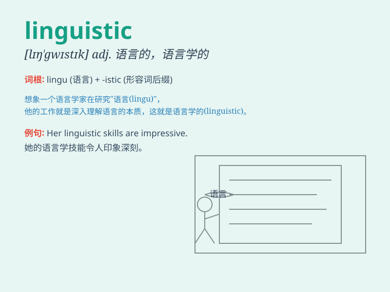

## linguistic

**英音:** _[lɪŋ\'gwɪstɪk]_ **美音:** _[lɪŋ\'gwɪstɪk]_

**译义:** *adj.语言上的,语言学上的*

### 短语

+ **linguistic ability:** _语言能力_

+ **linguistic diversity:** _语言多样性_

+ **linguistic feature:** _语言特征_

+ **linguistic form:** _语言形式_

+ **linguistic context:** _语言语境_

### 例句

#### 例句1

> **Linguistic skills are essential for effective communication.**

**中文翻译:** 语言技能对于有效沟通至关重要。

**单词释义:** 语言的；语言学的

#### 例句2

> **The study of linguistic diversity is very interesting.**

**中文翻译:** 对语言多样性的研究非常有趣。

**单词释义:** 语言的；语言学的

#### 例句3

> **She has a strong background in linguistic research.**

**中文翻译:** 她在语言学研究方面拥有深厚的背景。

**单词释义:** 语言的；语言学的

### 背诵小故事

> A linguist was studying in a quiet forest. One day, he found a magic
book that could reveal the secrets of linguistic. With it, he understood
all the languages of the animals and birds. He became famous for his
linguistic skills.

**一位语言学家在安静的森林里学习。有一天，他发现了一本神奇的书，可以揭示语言方面的秘密。凭借它，他理解了所有动物和鸟类的语言。他因语言技能而出名。**

### 图义

