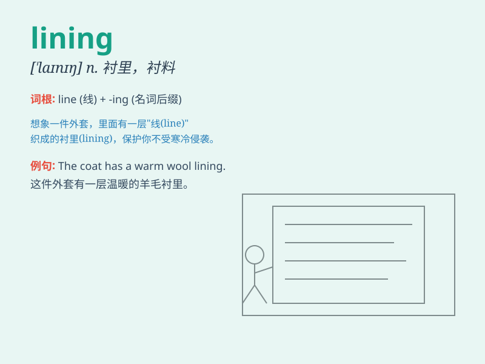

## lining

**英音:** _[\'laɪnɪŋ]_ **美音:** _[\'laɪnɪŋ]_

**译义:** *n.加衬里,内层,衬套*

### 短语

+ **lining paper:** _衬纸_

+ **lining fabric:** _衬里织物_

+ **coat lining:** _外套衬里_

+ **shoe lining:** _鞋衬_

+ **lining material:** _衬里材料_

### 例句

#### 例句1

> **The lining of the coat is made of silk.**

**中文翻译:** 大衣的衬里是丝绸制成的。

**单词释义:** 衬里；衬料

#### 例句2

> **The lining of the box is padded to protect the contents.**

**中文翻译:** 盒子的衬里有衬垫以保护内容物。

**单词释义:** 衬里；衬层

#### 例句3

> **The cloud had a silver lining.**

**中文翻译:** 乌云也有一线希望。

**单词释义:** （不幸或失望中的）一线希望

### 背诵小故事

> Once upon a time, a tailor was working hard on sewing the lining of a
beautiful dress. The lining made the dress more comfortable and perfect.
It was the hidden but important part that gave the dress its charm.

**从前，有个裁缝正在努力缝制一件漂亮裙子的衬里。衬里让裙子更舒适和完美。它是隐藏但重要的部分，赋予了裙子魅力。**

### 图义

