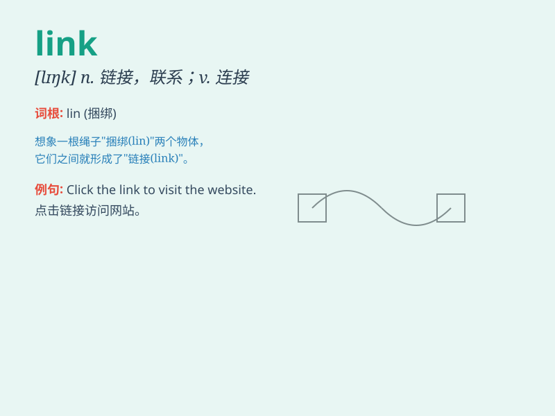

## link

**英音:** _[lɪŋk]_ **美音:** _[lɪŋk]_

**译义:** *n.链环,连结物,火把,链接vt.连结,联合,挽vi.连接起来*

### 短语

+ **link up:** _连接；结合；使连接_

+ **link with:** _与\...连接；与\...有关联_

+ **data link:** _数据链路_

+ **link together:** _连接在一起_

+ **link road:** _连接道路_

### 例句

#### 例句1

> **The new road will link the two towns.**

**中文翻译:** 新道路将连接两个城镇。

**单词释义:** 连接；联系

#### 例句2

> **Click on the link to visit our website.**

**中文翻译:** 单击链接访问我们的网站。

**单词释义:** 链接

#### 例句3

> **There is a strong link between smoking and lung cancer.**

**中文翻译:** 吸烟与肺癌之间存在密切联系。

**单词释义:** 关联；关系

### 背诵小故事

> One day, a little bird was trying to link two branches together to
build a nest. It worked hard, using its beak and feet. Finally, the
branches were linked successfully and the bird had a cozy home.

**有一天，一只小鸟努力把两根树枝连接在一起筑巢。它努力工作，用它的喙和脚。最后，树枝成功连接起来，小鸟有了一个舒适的家。**

### 图义

