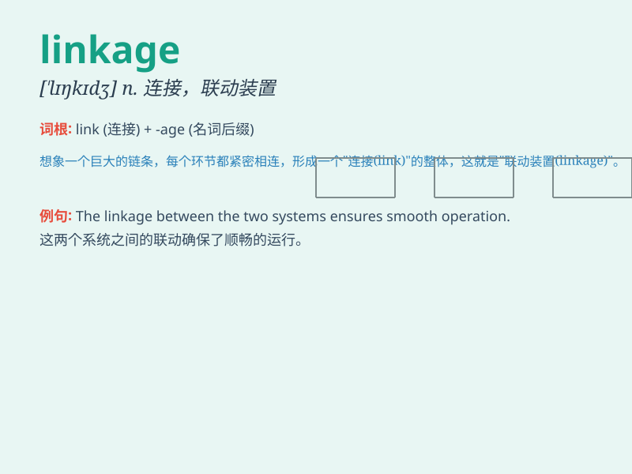

## linkage

**英音:** _[\'lɪŋkɪdʒ]_ **美音:** _[\'lɪŋkɪdʒ]_

**译义:** *n.联接*

### 短语

+ **mechanical linkage:** _机械联动装置_

+ **genetic linkage:** _遗传连锁_

+ **linkage group:** _连锁群_

+ **hydraulic linkage:** _液压联动装置_

+ **electrical linkage:** _电气联动装置_

### 例句

#### 例句1

> **The linkage between the two events was not immediately
obvious.**

**中文翻译:** 这两起事件之间的联系并不明显。

**单词释义:** 联系；连接；关联

#### 例句2

> **The new software provides a seamless linkage of data from
different sources.**

**中文翻译:** 新软件提供了不同来源数据的无缝链接。

**单词释义:** 连接；衔接

#### 例句3

> **There is a strong linkage between diet and health.**

**中文翻译:** 饮食与健康之间存在密切的联系。

**单词释义:** 联系；关系

### 背诵小故事

> Imagine a group of robots connected by special chains. These chains
are the \'linkage\' that ensures they work together smoothly. The
linkage keeps them in sync and allows them to perform complex tasks as a
team.

**想象一群机器人被特殊的链条连接着。这些链条就是\'linkage\'，确保它们能顺利地协同工作。这种连接使它们保持同步，并能作为一个团队执行复杂的任务。**

### 图义

