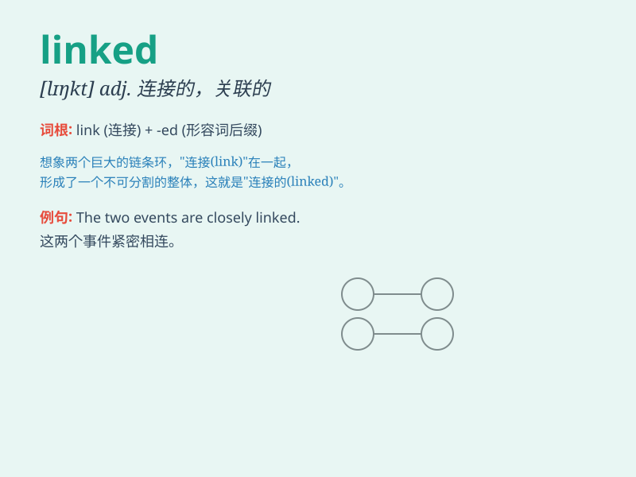

## linked

**英音:** _[lɪŋkt]_ **美音:** _[\'lɪŋkt]_

**译义:** *adj.连接的,显示连环遗传的*

### 短语

+ **linked list:** _链表_

+ **linked together:** _连接在一起_

+ **closely linked:** _紧密相连_

+ **be linked with:** _与\...\...有联系_

+ **linked up:** _连接；结合_

### 例句

#### 例句1

> **The two events are closely linked.**

**中文翻译:** 这两起事件密切相关。

**单词释义:** 连接；关联

#### 例句2

> **She linked her arm through his.**

**中文翻译:** 她挽着他的手臂。

**单词释义:** 挽住；勾住

#### 例句3

> **The new road will link the two towns.**

**中文翻译:** 新道路将连接两个城镇。

**单词释义:** 连接；接通

### 背诵小故事

> A detective was trying to solve a mystery. He found that all the
clues were linked like a chain. One clue led to another, and finally, he
caught the criminal. The word \'linked\' here means connected.

**一位侦探试图解开一个谜团。他发现所有的线索都像链条一样相互关联。一个线索指向另一个，最后，他抓住了罪犯。单词\'linked\'在这里意思是连接的。**

### 图义

