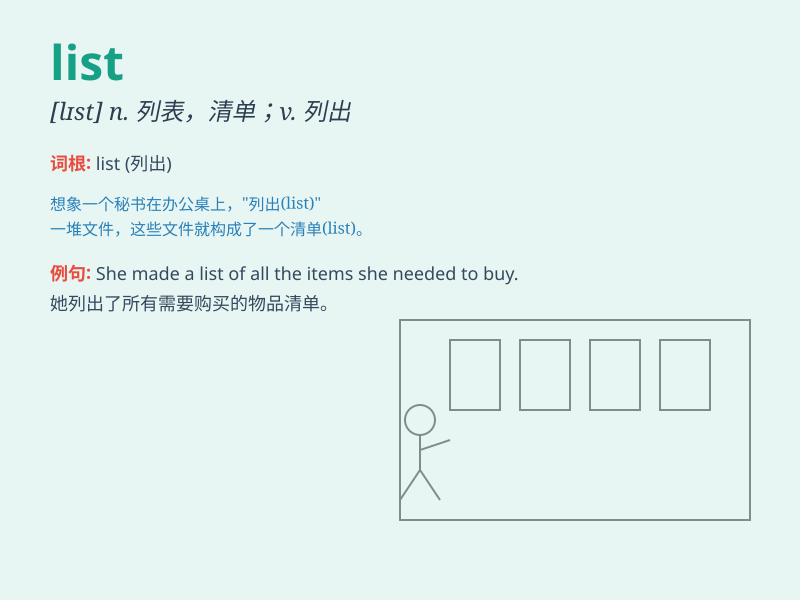

## list

**英音:** _[lɪst]_ **美音:** _[lɪst]_

**译义:**
*n.目录,名单,列表,序列,数据清单,明细表,条纹,[总称]各种上市证券vt.列出,列于表上,记入名单内,装布条vi.列于表上*

### 短语

+ **shopping list:** _购物清单_

+ **to-do list:** _待办事项清单_

+ **hit list:** _黑名单；暗杀名单_

+ **waiting list:** _等候名单；候补名单_

+ **guest list:** _宾客名单_

### 例句

#### 例句1

> **I made a list of things to buy at the supermarket.**

**中文翻译:** 我列了一张在超市要买的东西的清单。

**单词释义:** 清单；列表

#### 例句2

> **The names are listed alphabetically.**

**中文翻译:** 名称按字母顺序列出。

**单词释义:** 列出；罗列

#### 例句3

> **She was listed among the missing.**

**中文翻译:** 她被列为失踪人员之一。

**单词释义:** 把......列入；登记

### 背诵小故事

> One day, Tom made a list of his favorite books. He wrote down each
title carefully. When his friend asked about it, he could show the list
easily. With this list, he never forgot which books he loved.

**一天，汤姆列了一张他最喜欢的书的清单。他认真地写下了每一个书名。当他的朋友问起时，他能轻松地展示这张清单。有了这张清单，他永远不会忘记他喜欢哪些书。**

### 图义

