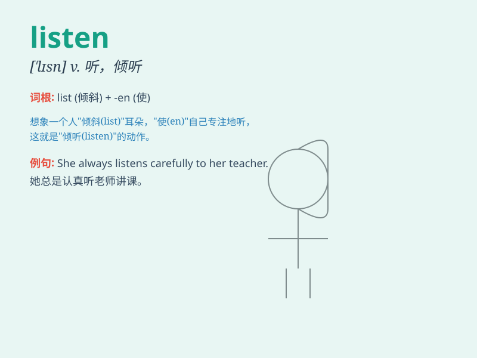

## listen

**英音:** _[\'lɪs(ə)n]_ **美音:** _[\'lɪsn]_

**译义:** *vi.听,听从v.听,收听*

### 短语

+ **listen to:** _倾听；听从_

+ **listen for:** _等着听；留神听_

+ **listen in:** _收听；监听_

+ **listen out:** _留神等着听_

+ **listen up:** _注意听；认真听_

### 例句

#### 例句1

> **I like to listen to music when I\'m relaxing.**

**中文翻译:** 当我放松的时候我喜欢听音乐。

**单词释义:** 听

#### 例句2

> **Please listen carefully to the instructions.**

**中文翻译:** 请仔细聆听说明。

**单词释义:** 听

#### 例句3

> **She never listens to my advice.**

**中文翻译:** 她从来不听我的建议。

**单词释义:** 听从

### 背诵小故事

> One day, a little mouse was hiding in a corner. When it heard the
footsteps of a cat, it listened carefully and prepared to run away. By
listening attentively, the mouse saved itself.

**一天，一只小老鼠躲在角落里。当它听到猫的脚步声时，它仔细地倾听，并准备逃跑。通过用心倾听，老鼠救了自己。**

### 图义

