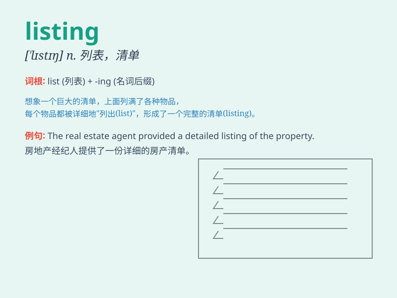

## listing

**英音:** _[\'lɪstɪŋ]_ **美音:** _[\'lɪstɪŋ]_

**译义:** *n.[计] 清单,列表 vbl.list的进行时*

### 短语

+ **stock listing:** _股票上市_

+ **job listing:** _招聘启事_

+ **property listing:** _房产清单_

+ **listing price:** _上市价格；标价_

+ **directory listing:** _目录列表_

### 例句

#### 例句1

> **The real estate agent provided a detailed listing of available
properties.**

**中文翻译:** 房地产经纪人提供了可用房产的详细清单。

**单词释义:** 清单；列表

#### 例句2

> **The company\'s stock listing on the exchange was highly
anticipated.**

**中文翻译:** 该公司的股票在交易所上市备受期待。

**单词释义:** 上市

#### 例句3

> **I found the job listing in the newspaper.**

**中文翻译:** 我在报纸上找到了招聘信息。

**单词释义:** 列表；目录

### 背诵小故事

> A young entrepreneur was very nervous when preparing the listing of
his new company. He worked hard day and night to make everything
perfect. Finally, the listing was successful and his business thrived.

**一位年轻的企业家在准备他新公司的上市时非常紧张。他日夜努力工作，以使一切尽善尽美。最终，上市成功，他的生意蓬勃发展。**

### 图义

