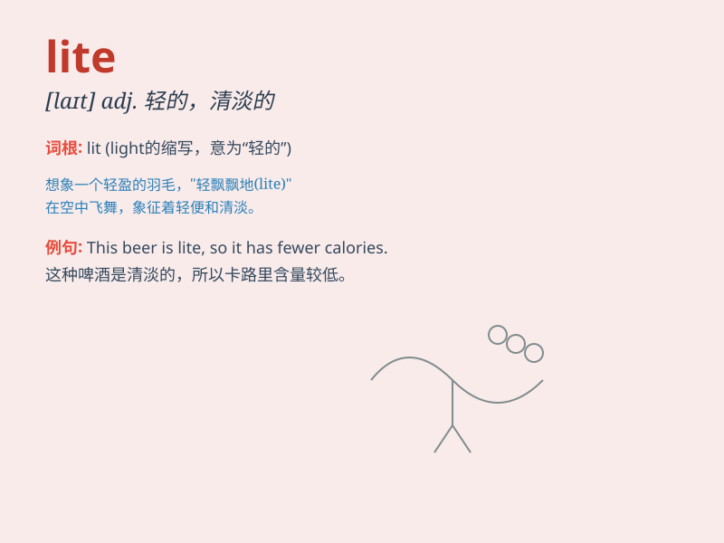

## lite

**英音:** _[laɪt]_ **美音:** _[laɪt]_

**译义:** *adj.清淡的,低盐的*

### 短语

+ **lite version:** _精简版；简化版_

+ **lite beer:** _低热量啤酒；淡啤酒_

+ **lite food:** _清淡的食物_

+ **lite reading:** _轻松的阅读；消遣性阅读_

+ **lite exercise:** _轻度锻炼；轻松的运动_

### 例句

#### 例句1

> **I prefer the lite version of this software as it takes up less
space on my computer.**

**中文翻译:**
我更喜欢该软件的精简版，因为它在我的计算机上占用的空间更少。

**单词释义:** 精简的；简化的

#### 例句2

> **The lite meal was just enough to satisfy my hunger without making
me feel too full.**

**中文翻译:** 简单的一餐足以满足我的饥饿感，又不会让我感到太饱。

**单词释义:** 清淡的；少量的

#### 例句3

> **She drinks lite coffee to cut down on caffeine intake.**

**中文翻译:** 她喝淡咖啡以减少咖啡因的摄入量。

**单词释义:** 低热量的；低咖啡因的

### 背诵小故事

> Imagine a little elf who loves light. But he can\'t handle too much
of it, so he prefers \'lite\' light. This lite light is just right for
him to play and have fun.

**想象一个小精灵喜欢光。但他受不了太多的光，所以他更喜欢'lite'这种少量的光。这种轻度的光对他玩耍和娱乐来说刚刚好。**

### 图义

